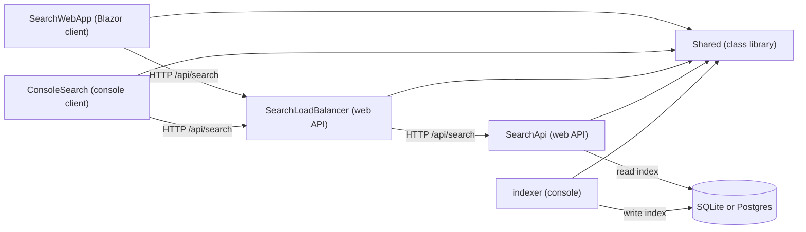
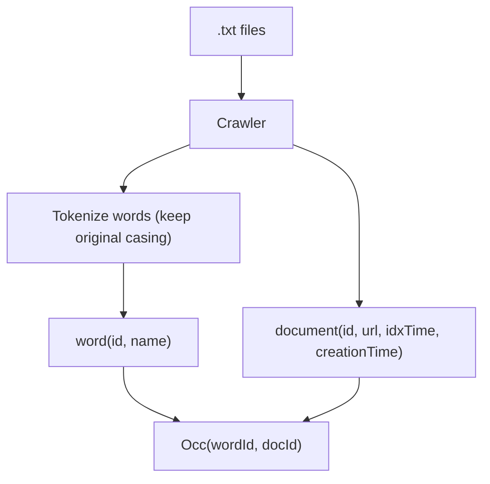
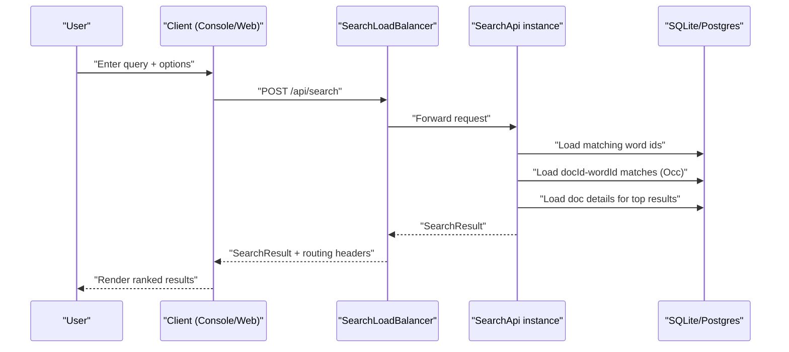
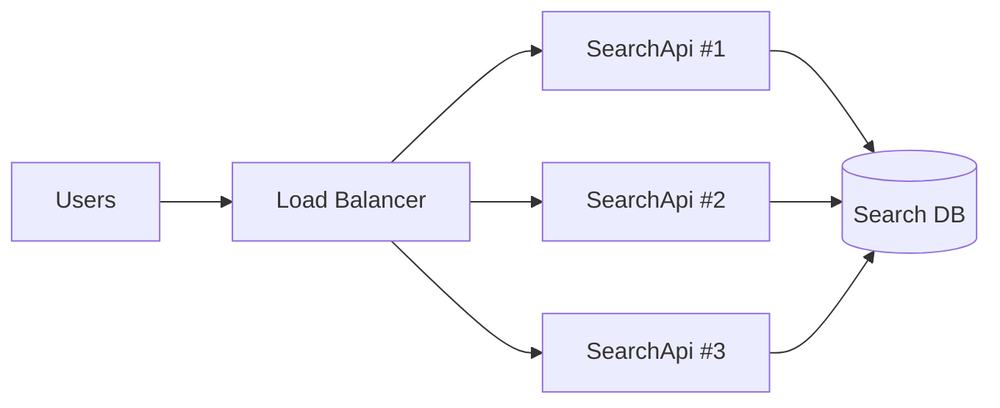
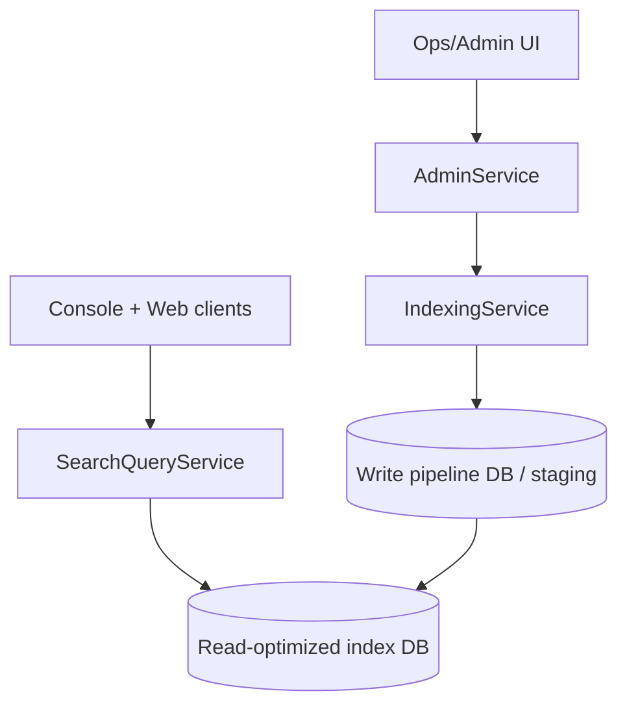
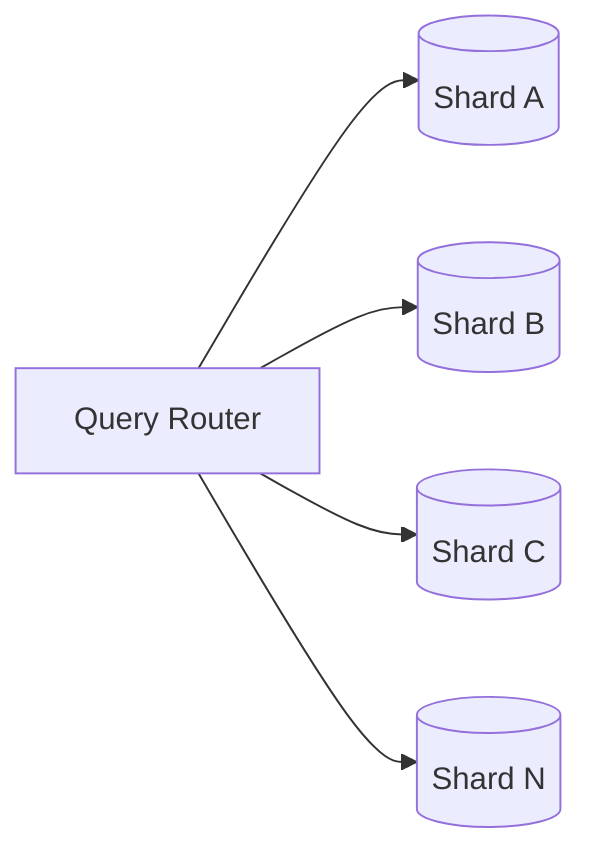
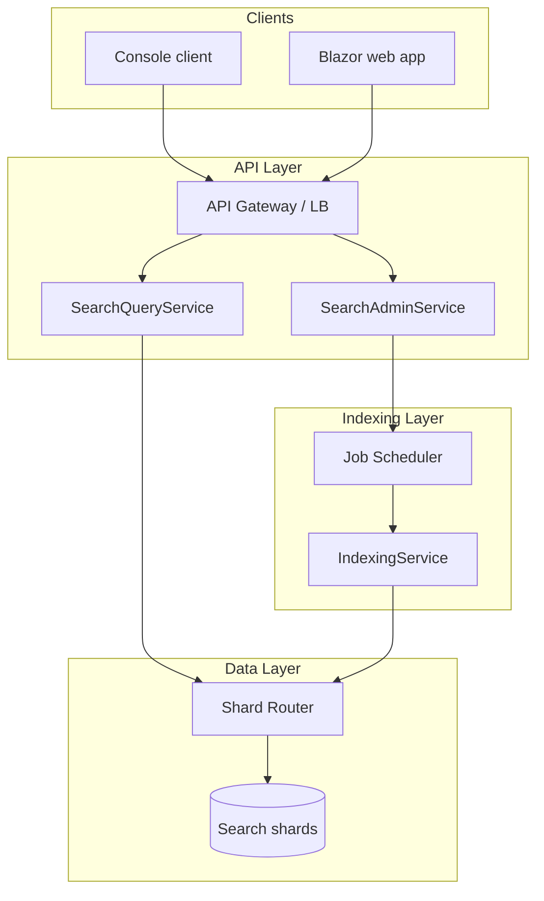

# Architecture

Status: 2026-02-17

This document describes:
- Current project and codebase architecture.
- Scaling options using X, Y, Z scaling.
- Concrete improvements from the current baseline.

## 1. Current Solution Architecture

The solution contains 6 projects:

| Project | Type | Responsibility | Depends on |
|---|---|---|---|
| `indexer` | Console app | Crawls `.txt` files, builds reverse index in DB | `Shared`, `SQLite`, `Postgres` |
| `SearchApi` | ASP.NET Core API | Search logic and DB reads | `Shared`, `SQLite`, `Postgres` |
| `SearchLoadBalancer` | ASP.NET Core API | Stateless traffic distribution across SearchApi instances | `Shared` |
| `ConsoleSearch` | Console app | User interaction over HTTP to load balancer | `Shared` |
| `SearchWebApp` | Blazor app | Web UI over HTTP to load balancer | `Shared` |
| `Shared` | Class library | Shared DTOs/models and DB paths | none |

### 1.1 Project Dependency Graph

## 2. Runtime Architecture (Codebase Behavior)

### 2.1 Indexing Flow

1. `indexer` walks folder tree from `Config.FOLDER`.
2. Splits text into words using separators.
3. Stores words with original casing in table `word`.
4. Stores document metadata in `document`.
5. Stores reverse index links in `Occ(wordId, docId)`.

### 2.2 Query Flow

1. Client sends `SearchRequest` to load balancer `POST /api/search`.
2. Load balancer picks backend with scheduler strategy.
3. Selected SearchApi resolves word ids:
4. Case-sensitive mode: exact word match.
5. Case-insensitive mode: all case variants by `lower(word)`.
6. SearchApi ranks documents by number of query terms matched.
7. Result is returned via load balancer with routing headers.

## 3. X, Y, Z Scaling Analysis

AKF scaling summary:

| Axis | Meaning | Current State | Risk | Recommended Direction |
|---|---|---|---|---|
| X-axis | Clone same service behind LB | Implemented (`SearchLoadBalancer` + multiple `SearchApi` instances) | DB becomes bottleneck | Add DB tuning + cache + backend health checks |
| Y-axis | Split by business capability | Partial split exists (`indexer` vs query API) | `SearchApi` can grow into monolith | Split query, indexing control, and admin APIs |
| Z-axis | Partition data (sharding) | Not implemented | Single DB limits size/throughput | Shard by tenant/domain/time and route queries |

### 3.1 X-axis (horizontal clone)

Good fit now:
- `SearchApi` has no server-side session state.
- Clients already talk HTTP.

Needed to scale safely:
- Central config (not hardcoded paths).
- DB connection pool tuning.
- Optional result cache for hot queries.

### 3.2 Y-axis (functional decomposition)

Current:
- `indexer` and `SearchApi` are already separate runtime components.

Next useful split:
- `SearchQueryService`: read/search only.
- `IndexingService`: crawl + index jobs.
- `AdminService`: health, stats, reindex orchestration.

### 3.3 Z-axis (data partitioning)

When corpus size or tenant count grows, partition by:
- Tenant/customer id.
- Data domain (example: mailbox/user group).
- Time slice (older partitions colder storage).

## 4. Shared Library Assessment

Current `Shared` library is practical in one repo, but it increases coupling:
- Any change in shared models can force rebuild/redeploy of multiple projects.
- `Shared.Paths` contains machine-specific DB paths and runtime config concerns.

Recommended split:

1. Keep only API contracts in a tiny shared package:
   - `Search.Contracts` (`SearchRequest`, `SearchResult`, DTOs).
2. Move runtime configuration out of shared code:
   - Use `appsettings.json` + environment variables in each project.
3. Keep domain/infrastructure internal per service:
   - `indexer` models and DB code private to indexing.
   - `SearchApi` DB adapters private to query service.

This preserves team autonomy for Y/Z scaling while still avoiding duplicate DTO code.

## 5. Improvement Backlog (Concrete)

### P0 (high impact, low-medium effort)

1. Replace hardcoded DB paths/connection strings with configuration per project.
2. Add integration tests for:
   - Case-sensitive vs case-insensitive behavior.
   - Multi-term missing/hits ranking logic.
3. Add health/readiness checks for DB connectivity.

### P1 (scaling and reliability)

1. Avoid loading full word maps per request:
   - Cache case maps in memory with refresh strategy.
   - Or move case-insensitive lookup into indexed SQL strategy.
2. Introduce query result caching for hot terms.
3. Add structured logging + metrics (latency, QPS, cache hit rate).

### P2 (architecture evolution)

1. Split `SearchApi` into query/admin capabilities (Y-axis).
2. Add shard router abstraction and shard key design (Z-axis).
3. Consider OpenAPI-generated clients for Console/Web to reduce manual coupling.

## 6. Recommended Target Architecture

## 7. Migration Path (Safe Order)

1. Stabilize contracts and config externalization.
2. Add tests and observability.
3. Introduce query caching and DB optimizations.
4. Split API responsibilities (Y-axis).
5. Add shard router and roll out Z-axis partitioning gradually.
