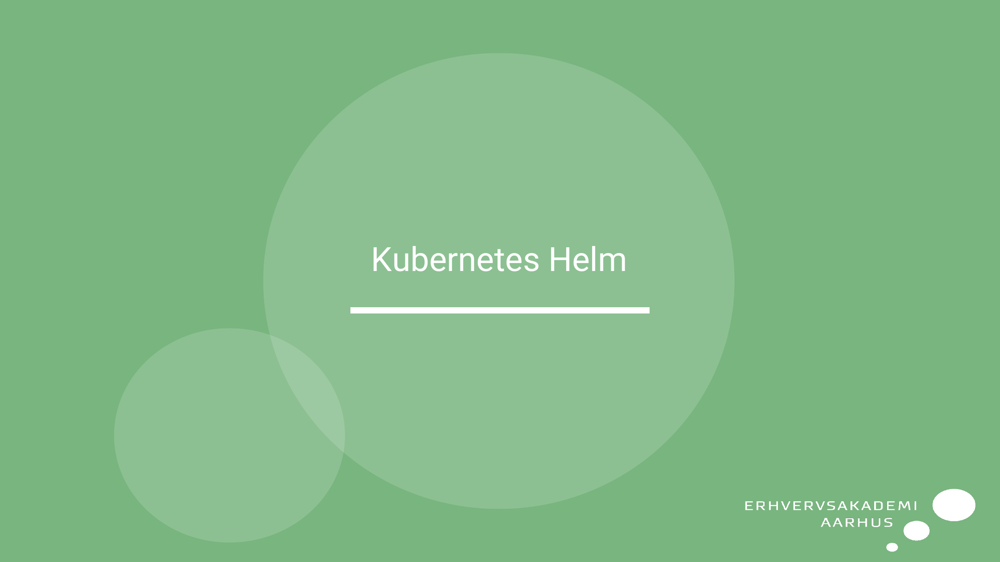
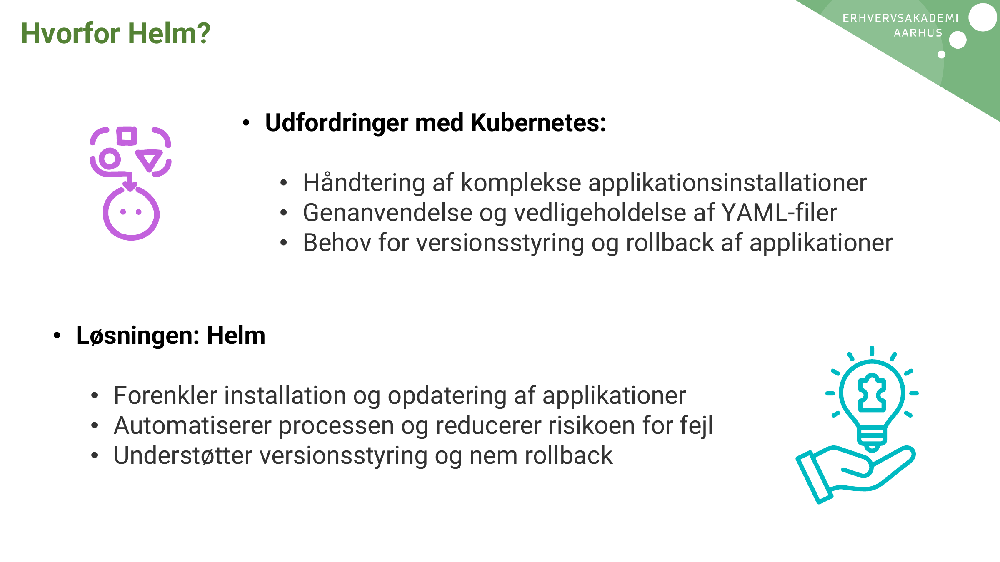
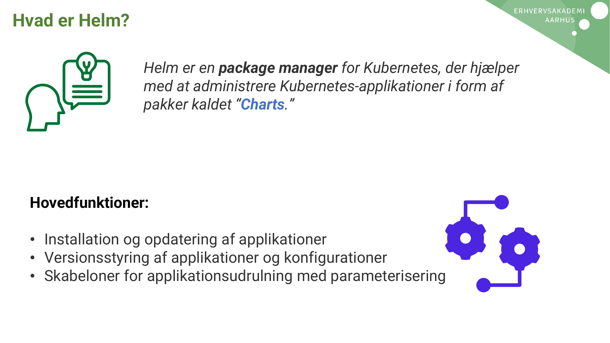
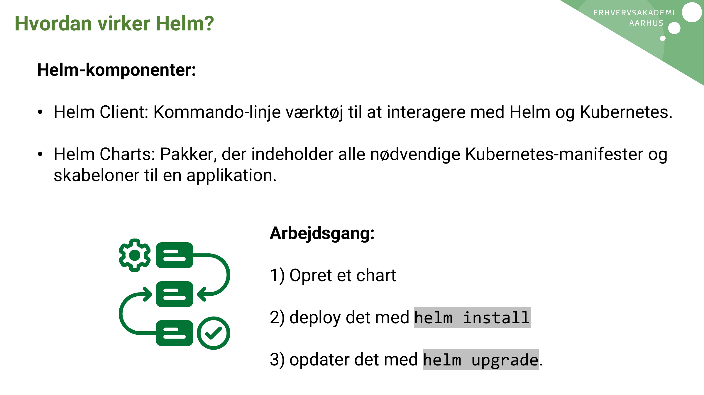
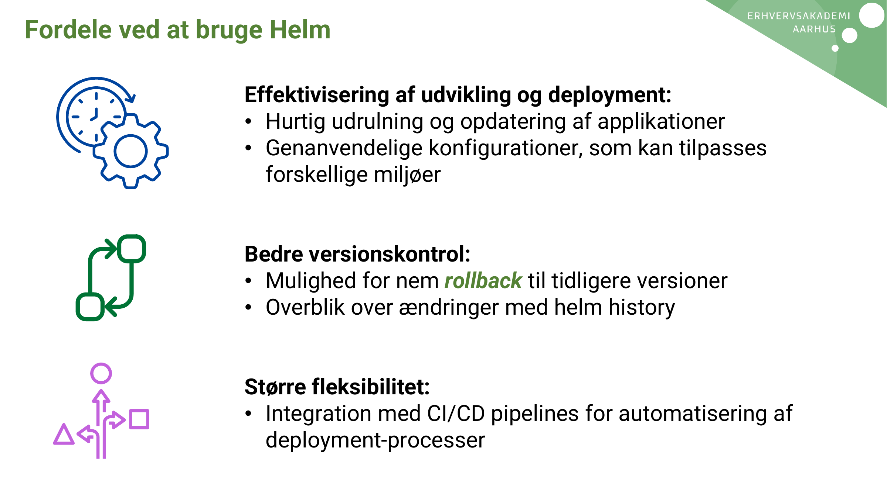
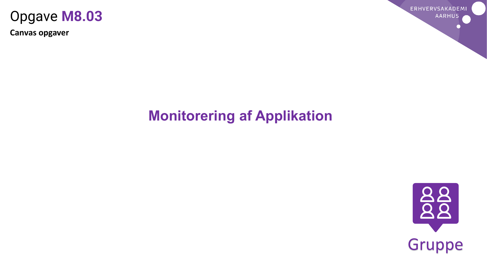

# AI Extract: Emne - Helm pakkestyring.pdf

- Kilde: `Emne - Helm pakkestyring.pdf`
- Type: `pdf`
- Artefakter: tekst + sidebilleder

## Tekst

\`\`\`text
Kubernetes Helm
Hvorfor Helm?

                 • Udfordringer med Kubernetes:

                      • Håndtering af komplekse applikationsinstallationer
                      • Genanvendelse og vedligeholdelse af YAML-filer
                      • Behov for versionsstyring og rollback af applikationer

  • Løsningen: Helm

    • Forenkler installation og opdatering af applikationer
    • Automatiserer processen og reducerer risikoen for fejl
    • Understøtter versionsstyring og nem rollback
Hvad er Helm?

                 Helm er en package manager for Kubernetes, der hjælper
                 med at administrere Kubernetes-applikationer i form af
                 pakker kaldet “Charts.”

 Hovedfunktioner:

 • Installation og opdatering af applikationer
 • Versionsstyring af applikationer og konfigurationer
 • Skabeloner for applikationsudrulning med parameterisering
Hvordan virker Helm?

  Helm-komponenter:

  • Helm Client: Kommando-linje værktøj til at interagere med Helm og Kubernetes.

  • Helm Charts: Pakker, der indeholder alle nødvendige Kubernetes-manifester og
    skabeloner til en applikation.

                              Arbejdsgang:

                              1) Opret et chart

                              2) deploy det med helm install

                              3) opdater det med helm upgrade.
Fordele ved at bruge Helm

                 Effektivisering af udvikling og deployment:
                 • Hurtig udrulning og opdatering af applikationer
                 • Genanvendelige konfigurationer, som kan tilpasses
                   forskellige miljøer

                 Bedre versionskontrol:
                 • Mulighed for nem rollback til tidligere versioner
                 • Overblik over ændringer med helm history

                 Større fleksibilitet:
                 • Integration med CI/CD pipelines for automatisering af
                   deployment-processer
Opgave M8.03
Canvas opgaver

                 Monitorering af Applikation

                                               Gruppe

\`\`\`

## Sider som billeder

