# AI Extract: Emne - Intro til operations.pdf

- Kilde: `Emne - Intro til operations.pdf`
- Type: `pdf`
- Artefakter: tekst + sidebilleder

## Tekst

\`\`\`text
Operations
Hvad er Operations?

                  Definition:
                  Administration og vedligeholdelse af IT-systemer og -tjenester.

                  Formål:
                  Sikre stabilitet, tilgængelighed og ydeevne.

                  Nøgleaktiviteter:
                  Overvågning, support og vedligeholdelse.
Arkitekt Principper i Operations
Betydningen af Operations i IT

                 • Systemtilgængelighed: Minimere nedetid.

                 • Ydeevneoptimering: Sikre effektiv drift.

                 • Sikkerhed: Beskytte mod trusler og sårbarheder.

                 • Skalering: Understøtte vækst og forretningsbehov.
IT Miljøer

 Komponenter:                            Roller:

    • Hardware og infrastruktur.            • Operations-team.

    • Software og applikationer.            • Support og service-desk.

    • Netværk og kommunikation.             • System- og netværksadministratorer.

                          Dokumentation:

                          •   Deployment & Container diagrammer
Skalering

            Udfordringer:

               • Håndtering af øget belastning.
               • Bevare ydeevne og stabilitet.

            Løsninger:

               • Automatisering af processer.
               • Implementering af skalerbare arkitekturer.
               • Kontinuerlig overvågning og optimering.
Orkestrering - definition

                        • Koordinering og automatisering af flere processer
                          og tjenester.

                        • Styring af container-baserede applikationer på
                          tværs af forskellige miljøer.

                        • Sammenkædning af individuelle komponenter til en
                          samlet arbejdsproces.
Orkestrering - formål

                        Effektiv ressourcehåndtering:
                        Optimering af CPU, hukommelse og netværksbrug.

                        Automatiseret skalering:
                        Tilpasning af antal containere baseret på belastning.

                        Høj tilgængelighed:
                        Sikring af kontinuerlig drift med minimal nedetid.

                        Self-Healing:
                        Automatisk genstart af fejlede tjenester eller containere.
Hvorfor er orkestrering vigtigt?

                      Håndtering af kompleksitet:
                      Forenkler administrationen af mikroservice-arkitekturer.

                      Øget produktivitet:
                      Mindre manuel intervention, mere fokus på udvikling.

                      Skalerbarhed og fleksibilitet:
                      Hurtig tilpasning til ændrede forretningskrav.

                      Bedre fejltolerance: Robusthed over for fejl og
                      systemnedbrud.
Opgave
Opgave M7.01

    Incident management vs. Problem management

    • Hvad er det primære mål med managementområdet?
    • Hvilke trin indgår typisk i processen?
    • Hvilke roller er involveret?
    • Hvordan påvirker det designet af it-systemer og deres vedligeholdelse?
    • Hvilken værdi skaber processen for organisationen og for brugerne?

                                                             Grupper   Præsentation

\`\`\`

## Sider som billeder

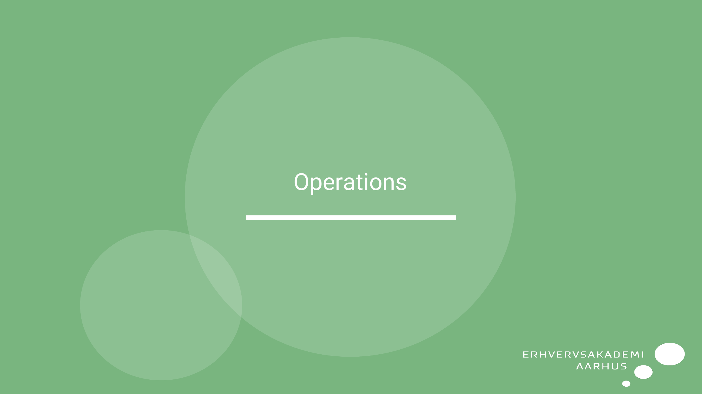
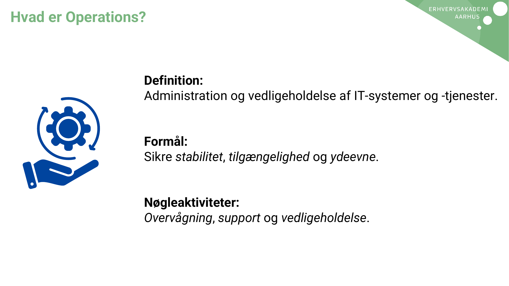
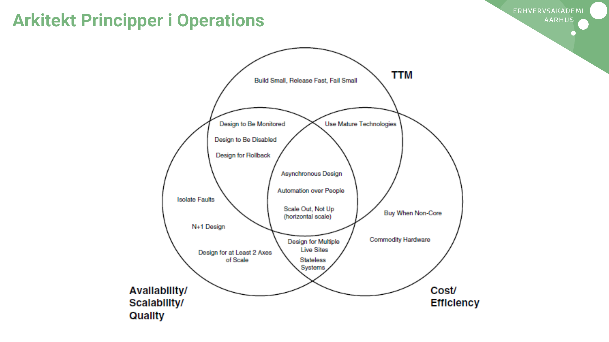
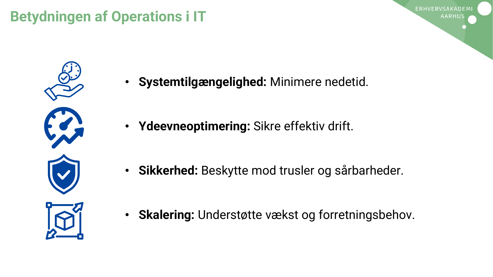
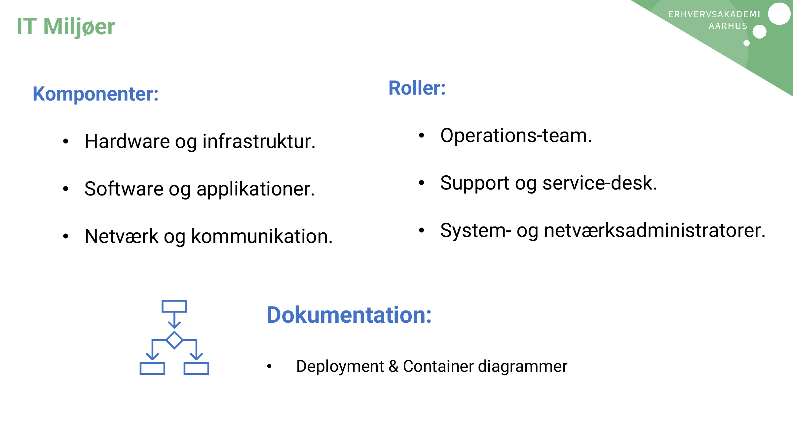
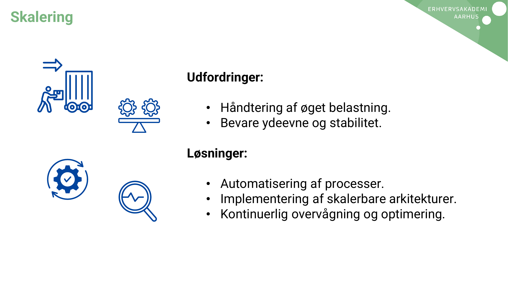
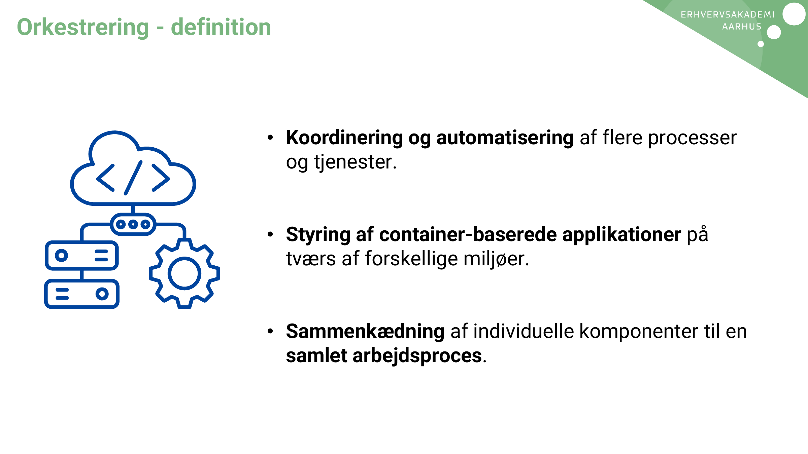
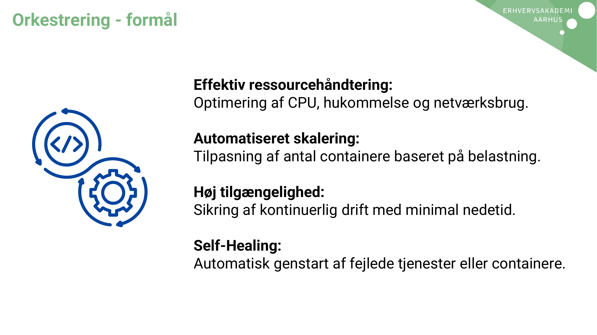
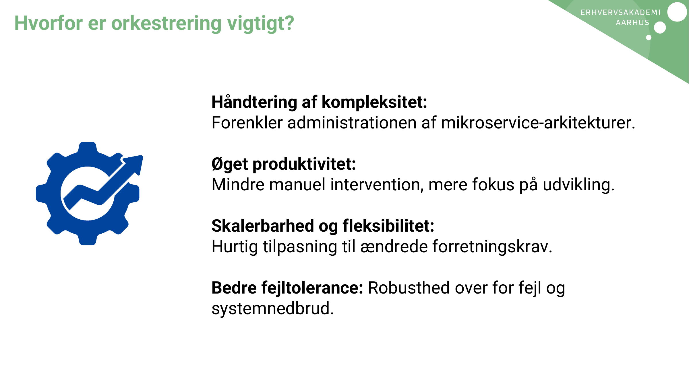
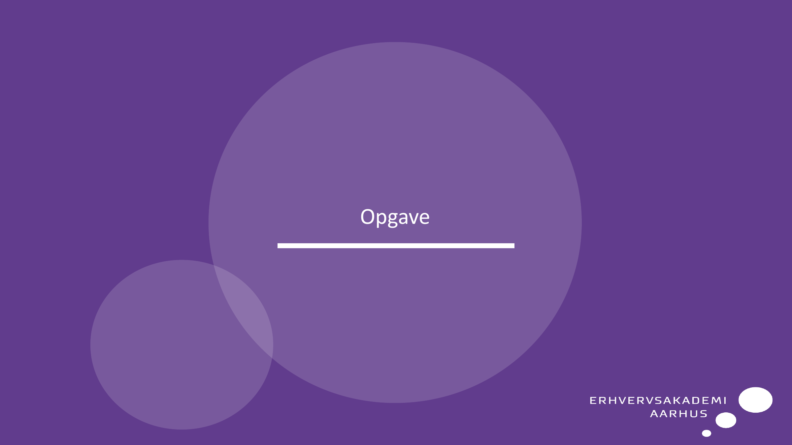
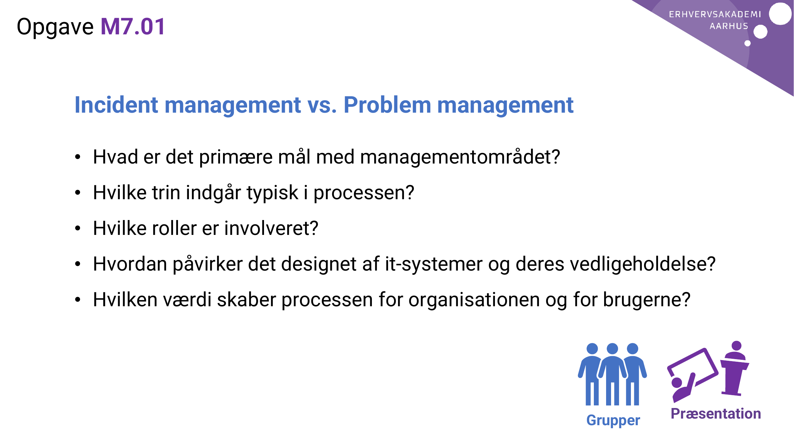

