# AI Extract: Emne - OpenTelemetry & Prometheus.pdf

- Kilde: `Emne - OpenTelemetry & Prometheus.pdf`
- Type: `pdf`
- Artefakter: tekst + sidebilleder

## Tekst

```text
OpenTelemetry
Hvad er OpenTelemetry?


                 • OpenTelemetry er et open-source observability framework.

                 • Det bruges til at indsamle, generere og eksportere
                   telemetridata.

                 • Understøtter logging, metrics og tracing.

                 • Standardiseret API og SDK'er til flere sprog.
Hvorfor bruge OpenTelemetry?


                    • Giver indsigt i applikationens performance.

                    • Hjælper med at identificere flaskehalse og fejl.

                    • Understøtter distribuerede systemer og mikroservices.

                    • Integreres let med eksisterende observability værktøjer.
OpenTelemetry arkitektur


                       • Består af API'er, SDK'er og eksportører.

                       • Indsamler data via instrumentering.

                       • Sender data til observability backend
                         (f.eks. Prometheus, Jaeger).

                       • Kan bruges med både automatiseret og
                         manuel instrumentering.
OpenTelemetry og .NET


                 • Microsoft understøtter OpenTelemetry i .NET.

                 • Kan bruges med ASP.NET Core Web API.

                 • Automatisk instrumentering af HTTP-klienter og databaser.

                 • Understøtter integration med Prometheus og Grafana
Opsætning af OpenTelemetry i .NET

 1. Installer OpenTelemetry SDK via NuGet.
 2. Konfigurer TracerProvider og/eller MetricsProvider.
 3. Tilføj eksportører til ønskede observability backends.
 4. Instrumentér kode til at spore forespørgsler og fejl.
              using OpenTelemetry.Metrics;
              using OpenTelemetry.Resources;

              var builder = WebApplication.CreateBuilder(args);
              builder.Services.AddOpenTelemetry()
                  .WithMetrics(metrics =>


 Program.cs
                  {
                      metrics.SetResourceBuilder(ResourceBuilder.CreateDefault().AddService("SearchEngineAPI"))
                             .AddAspNetCoreInstrumentation()
                             .AddMeter("SearchEngineAPI")
                             .AddPrometheusExporter();
                  });
              var app = builder.Build();
              app.UseOpenTelemetryPrometheusScrapingEndpoint(); // Gør metrics tilgængelige for Prometheus
              app.MapControllers();
              app.Run();
Metrics med OpenTelemetry
      using System;
      using System.Diagnostics.Metrics;
      using Microsoft.AspNetCore.Mvc;

      namespace SearchEngineAPI.Controllers
      {
          [ApiController]
          [Route("[controller]")]
          public class SearchController : ControllerBase
          {
              private static readonly Meter Meter = new Meter("SearchEngineAPI", "1.0");
              private static readonly Counter<long> QueryCounter =
                                              Meter.CreateCounter<long>("search_queries_total");
              [HttpGet("query")]
              public IActionResult Search(string term)
              {
                  // Øg tælleren hver gang en søgning udføres
                  QueryCounter.Add(1, new KeyValuePair<string, object>("query_term", term));

                  // Simulerer en søgning i databasen
                  var result = $"Result for '{term}'";

                  return Ok(result);
              }
          }
      }
Prometheus
Hvad er Prometheus?


                • Open source overvågnings- og alarmeringsværktøj

                • Indsamler og lagrer metrikker som tidsstempeldata

                • Fleksibel forespørgselssprog (PromQL) til analyse

                • Alertmanager til håndtering af alarmer

                • Kan integreres med Grafana, til visualisering af data
Integration af Prometheus og OpenTelemetry


                   • OpenTelemetry fokuserer på instrumentering og indsamling af
                     telemetridata (metrikker, logs, spor).


                   • Prometheus udmærker sig ved lagring, forespørgsler og
                     alarmering af metrikker.


                   • OpenTelemetry metrikker kan eksporteres til Prometheus ved
                     hjælp af Prometheus Exporter i OpenTelemetry Collector.
Prometheus i Kubernetes


       • Overvågning af Kubernetes-klyngekomponenter (noder, pods, containere)

       • Indsamling af metrikker fra applikationer, der kører i Kubernetes

       • Identifikation af performance-flaskehalse og ressourcebegrænsninger

       • Automatisk opdagelse af nye tjenester og pods

       • Muliggør autoskalering baseret på metrikker (K8s HPA)
Opgave M10.02
Canvas opgaver                             Prometheus

                           OpenTelemetry


                                                        Grafana


                 TestService       NLog


                                              Loki

```

## Sider som billeder

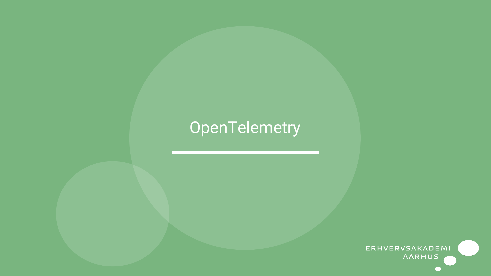
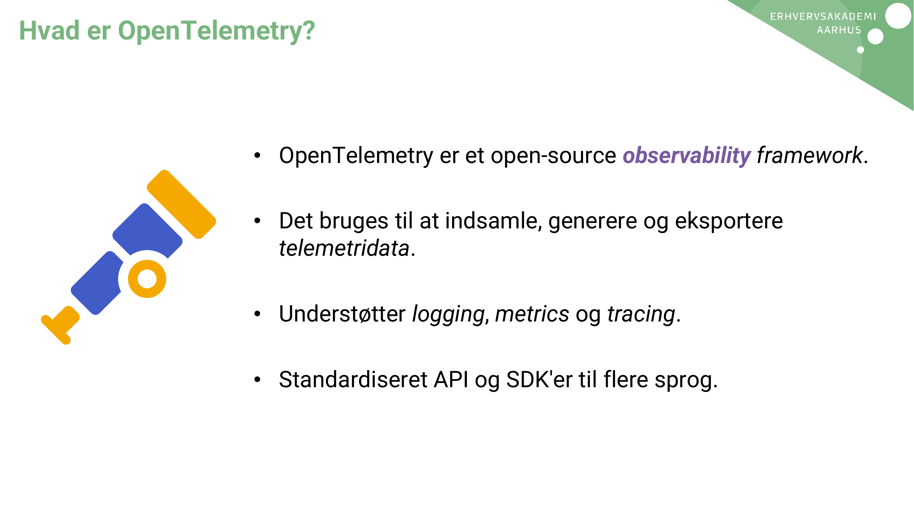
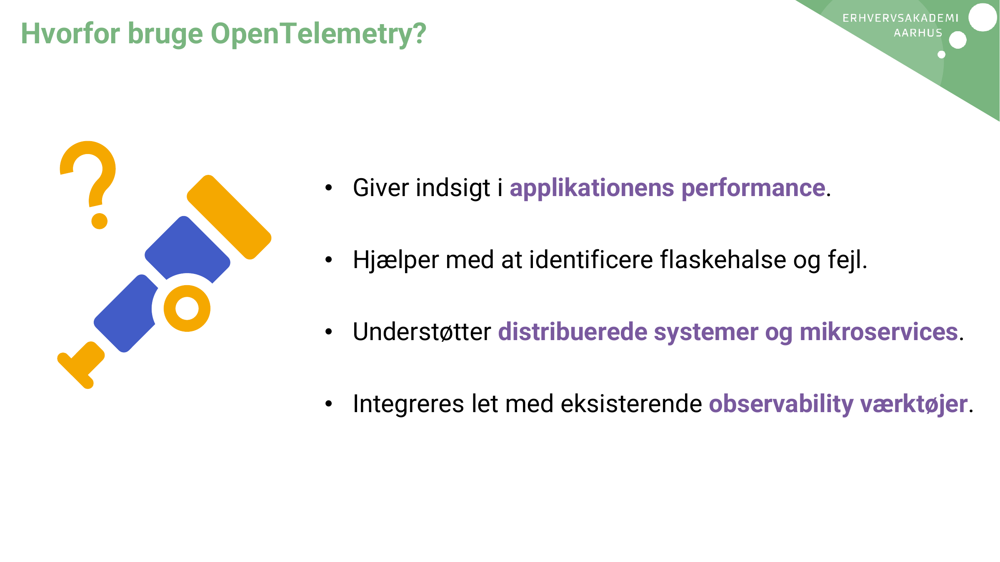
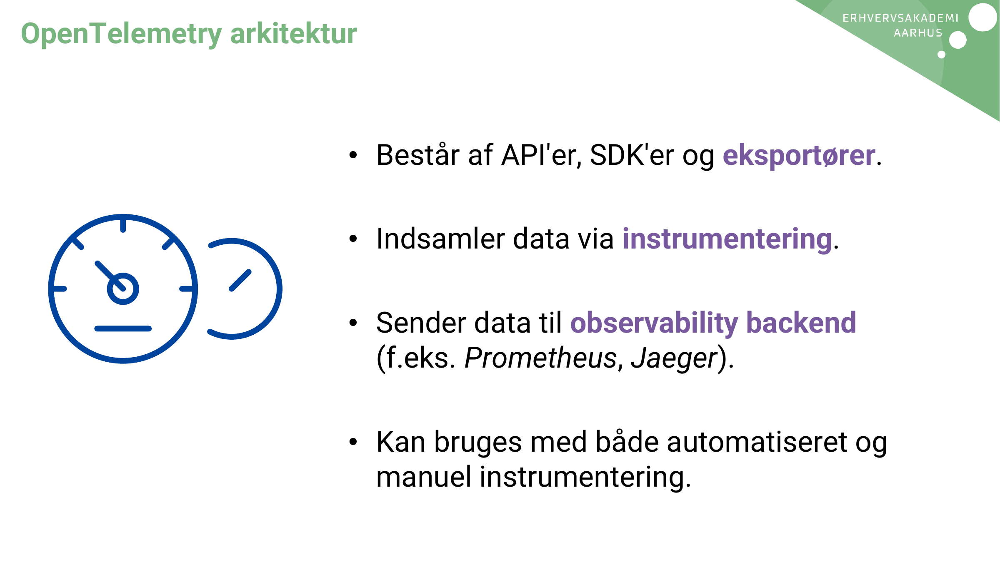
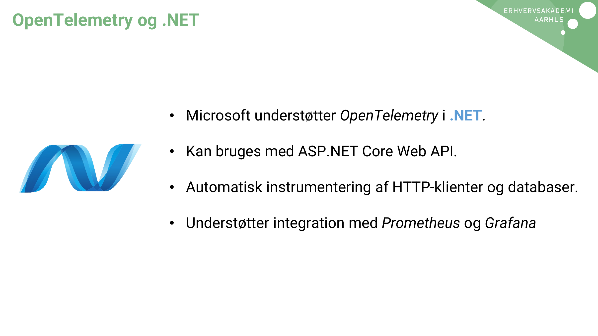
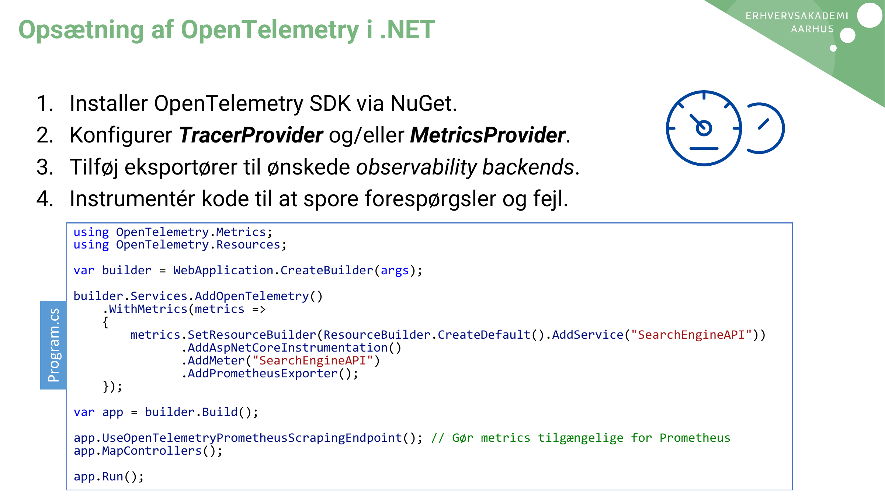
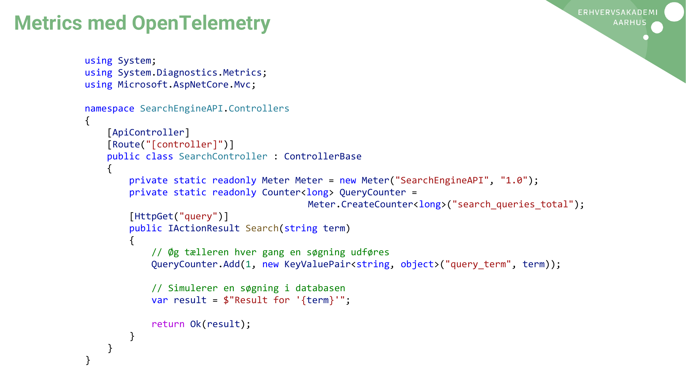

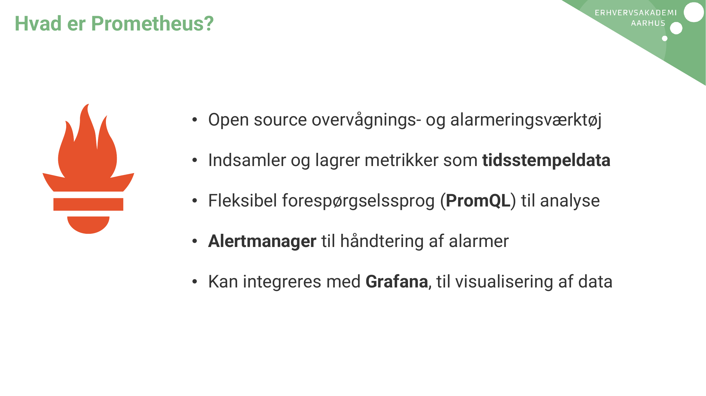
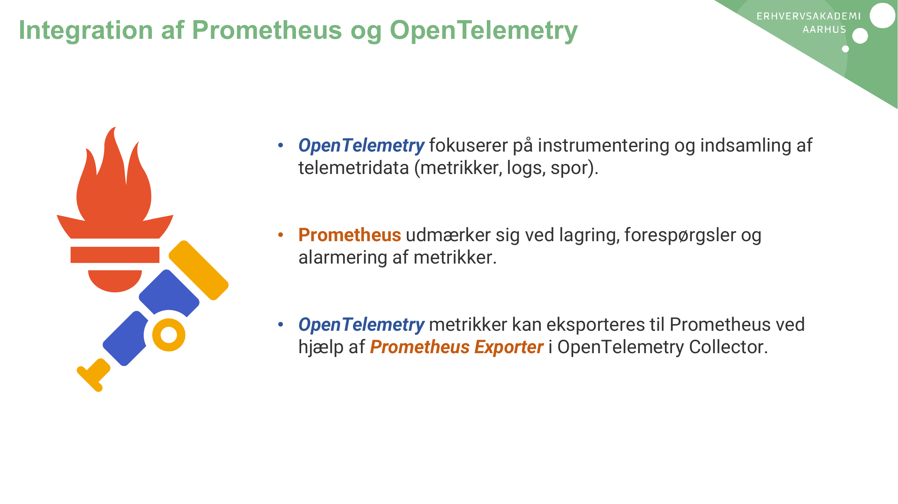
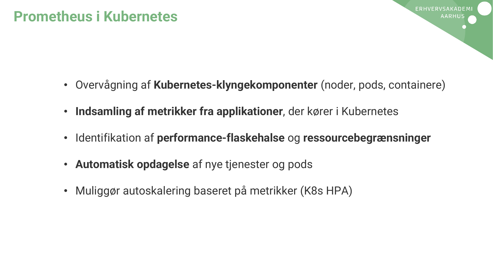
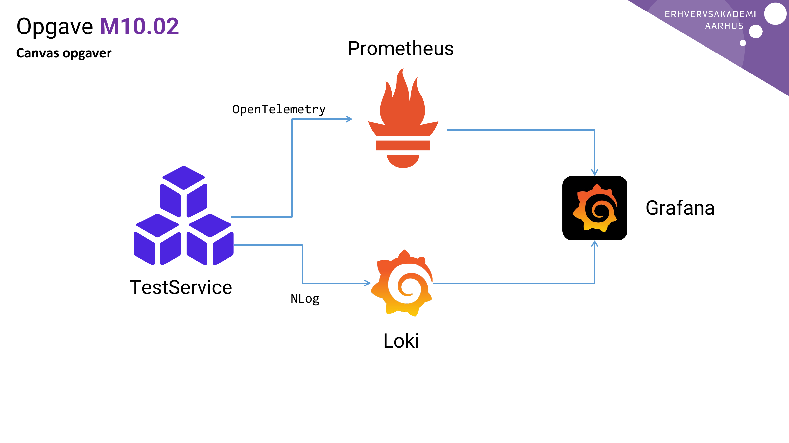

