# AI Extract: Emne - Performance.pdf

- Kilde: `Emne - Performance.pdf`
- Type: `pdf`
- Artefakter: tekst + sidebilleder

## Tekst

```text
Performance
Performance i IT-arkitektur: Hvorfor er det vigtigt?

                    • Performance handler om, hvor hurtigt og effektivt et system kan håndtere
                      forespørgsler og processere data.

                    • I praksis betyder god performance, at brugerne oplever korte svartider, stabil
                      drift og effektiv ressourceudnyttelse.

                    • Når vi arbejder med arkitekturprincipper, er performance et centralt
                      fokusområde, fordi det direkte påvirker brugeroplevelsen og systemets
                      skalerbarhed.

                    • En dårlig arkitektonisk beslutning kan føre til flaskehalse, højere
                      driftsomkostninger og begrænset mulighed for vækst. Derfor er det vigtigt at
                      overvåge og optimere performance gennem relevante metrikker som API-
                      svartider, databaseforespørgsler, systemressourceforbrug og
                      brugeroplevelsesdata.

                    • Ved at integrere performance-målinger i arkitekturdesignet sikrer vi, at
                      systemet er robust, skalerbart og i stand til at håndtere stigende belastning
                      uden at gå på kompromis med kvaliteten.
Arkitekturprincipper i Operations
Perfomance-metrikker
Hvad er Performancemetrikker?

  Performancemetrikker er målbare data, der giver indsigt i systemets
  effektivitet og pålidelighed. De bruges til at overvåge, evaluere og optimere
  systemets ydeevne i forhold til forskellige aspekter, så som:

                 • Hastighed (f.eks. responstid)

                 • Stabilitet (f.eks. fejlrater)

                 • Tilgængelighed (f.eks. oppetid)

                 • Effektivitet (f.eks. ressourceforbrug)

  Målet er at identificere og forbedre områder, hvor systemet kan optimeres for
  at sikre en bedre brugeroplevelse og højere driftssikkerhed.
API-anmodningsmetrikker (Requests)

                • Samlede Anmodninger pr. Sekund (RPS):
                  Spor antallet af API-anmodninger pr. sekund for at få indsigt i trafik
                  og spidsbelastningstider.

                • Forsinkelse (Anmodningsvarighed):
                  Mål den tid der går for at opfylde hver anmodning. Opdel i
                  percentiler (f.eks. p50, p90, p99) for at forstå både typisk og værste
                  ydelse.

                • Fejlrater:
                  Spor procentdelen af mislykkede anmodninger for at identificere
                  underliggende problemer.

                • Svarstatuskoder:
                  Overvåg HTTP-statuskoder (200'ere, 400'ere, 500'ere) for at
                  identificere problemer på API-niveau.
Databasemetrikker (SQLite)
                 • Forespørgselsudførelsestid:
                   Mål tiden, det tager for hver forespørgsel at blive gennemført. Høj tid kan
                   indikere et behov for optimering.

                 • Forespørgselsrate:
                   Spor antallet af forespørgsler pr. sekund for at vurdere belastningen på
                   databasen.

                 • Ventetider på Låse:
                   Da SQLite har begrænset understøttelse af samtidige skrivninger, kan
                   overvågning af ventetider på låse indikere konfliktproblemer.

                 • Cache-hitforhold:
                   Hvis SQLite-caching anvendes, viser dette, hvor ofte data leveres fra
                   cachen i stedet for at kræve en fuld forespørgsel.

                 • Fil I/O-forsinkelse:
                   SQLite afhænger meget af fil I/O; høj forsinkelse kan indikere
                   diskproblemer eller behov for optimering.
Systemressourcemetrikker


              • CPU-brug:
                Spor samlet CPU-brug og brug pr. kerne. Høj CPU-brug kan indikere ineffektiv
                forespørgselsbehandling.

              • Hukommelsesbrug:
                Overvåg hukommelsen for at sikre, at der ikke er hukommelseslækager eller
                overforbrug, som kan føre til nedbrud eller forsinkelser.

              • Disk I/O:
                Da SQLite er filbaseret, kan høj disk læse/skrive aktivitet eller I/O-ventetid i høj
                grad påvirke ydeevnen.

              • Netværksbrug:
                Mål netværksgennemstrømning for at sikre, at det kan håndtere volumen af
                API-anmodninger.
Metrikker på applikationsniveau


                   • Cache-udnyttelse:
                     Hvis søgeresultater caches, overvåg cache-hit/miss-
                     forhold og cache-størrelse for at sikre effektiv brug.

                   • Samtidighed og Trådmålinger:
                     Spor antallet af samtidige forbindelser/tråde for at forstå
                     belastningshåndtering og identificere flaskehalse.

                   • Oppetid og Tilgængelighed:
                     Spor oppetid for at sikre, at tjenesten er tilgængelig hele
                     tiden, ideelt set tæt på 100%.
Metrikker for brugeroplevelsen


                     • Gennemsnitlig Forespørgselstid pr. Bruger:
                       Segmenter forespørgselstider pr. bruger for at se, om
                       specifikke brugere oplever højere forsinkelser.


                     • Tid til Første Byte (TTFB):
                       Mål hvor hurtigt data begynder at blive sendt til brugeren
                       efter, at anmodningen er foretaget.
Performance Test
Performance Test


            1.Etabler succeskriterier. Definer de kriterier, der forventes af
            applikationen, komponenten, enheden eller systemet, der testes.


            2.Etabler det passende miljø. Sørg for, at testmiljøet ligner
            produktionsmiljøet for at sikre præcise testresultater.


            3.Definer testene. Der er mange forskellige kategorier af test, som
            du bør overveje at inkludere i performance testning, herunder
            udholdenhed, belastning, mest brugte og komponenttest.


                                                       -- The Art of Scalability, Abbot & Fisher
Performance Test

          4. Udfør testene. Dette trin er, hvor testene faktisk udføres i det miljø, der blev
          etableret i trin 2.


          5. Analyser dataene. Analyse af dataene kan tage mange former – nogle så simple
          som sammenligning med tidligere udgivelser, andre ved brug af stokastiske modeller.


          6. Rapportér til udviklere. Hvis de personer, der udfører testene, ikke er en del af det
          agile-team, skal der tages et ekstra trin for at kommunikere med de udviklere, der
          skrev softwaren. Lever analysen til dem og faciliter en diskussion om de relevante
          punkter.


          7. Gentag testene og analysen. Fortsæt med at teste og analysere dataene efter
          behov for at validere fejlrettelser. Hvis tid og ressourcer tillader det, bør testningen
          også fortsætte.
                                                                   -- The Art of Scalability, Abbot & Fisher
Opgave M10.01
Canvas opgaver


                 Design en performance test

```

## Sider som billeder

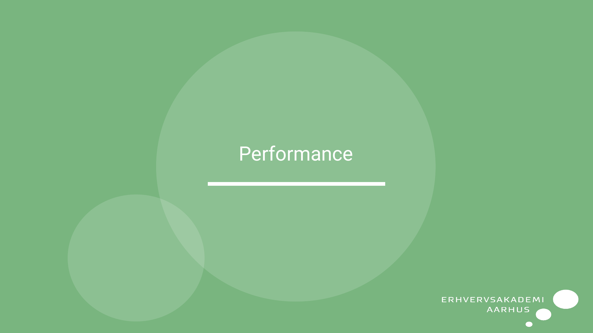
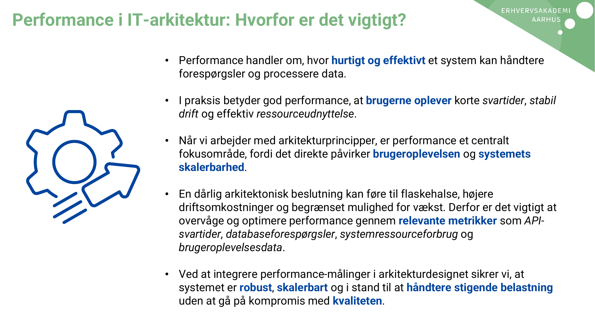
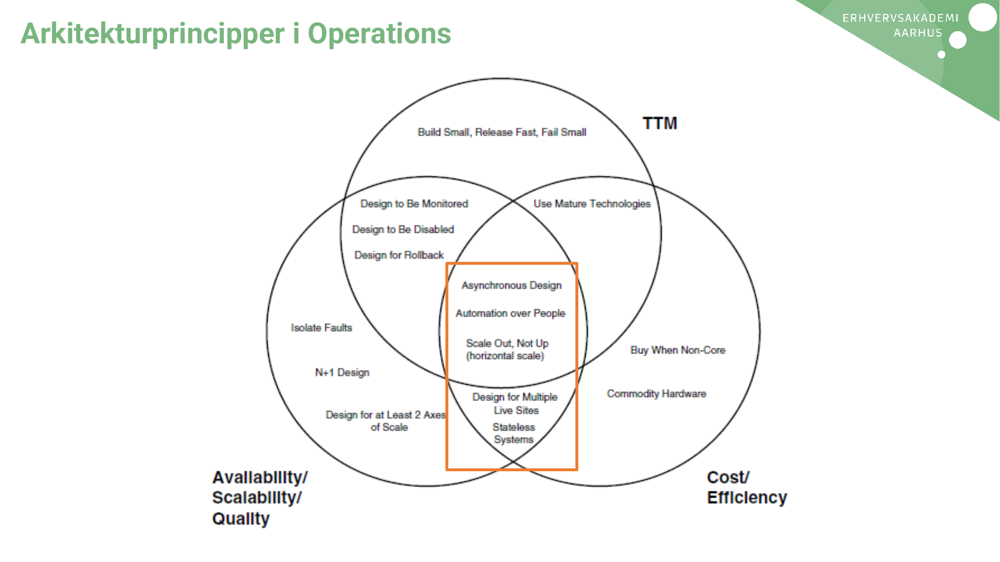
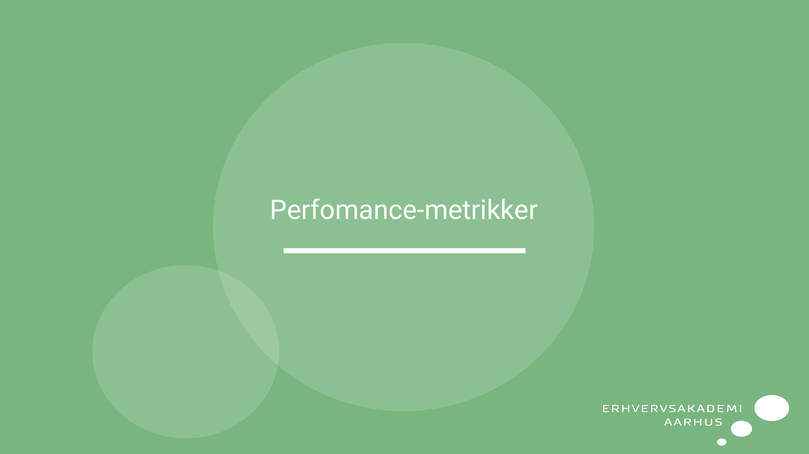
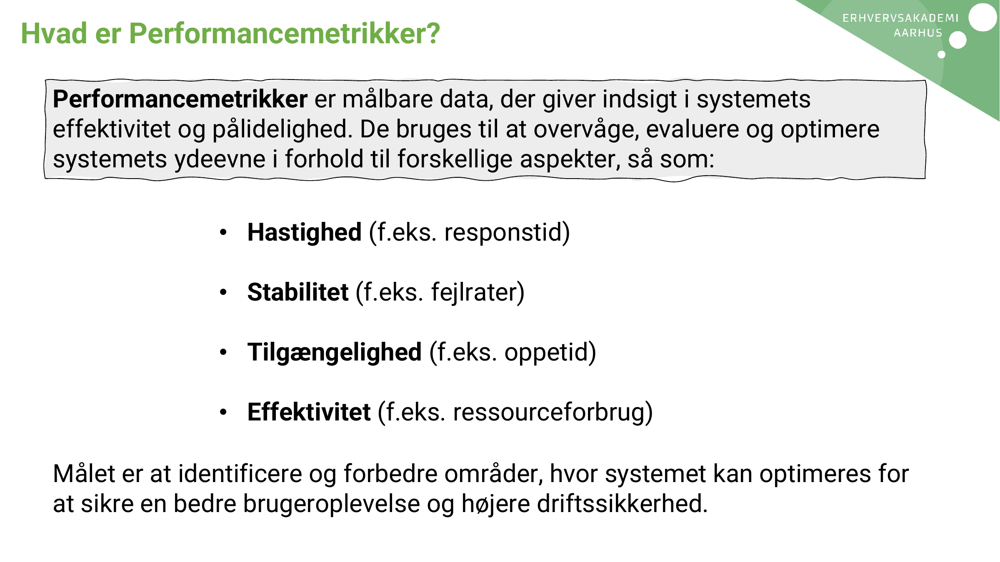
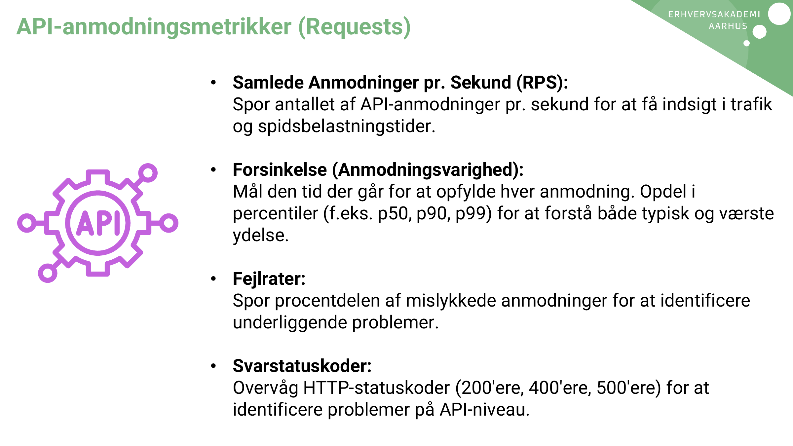
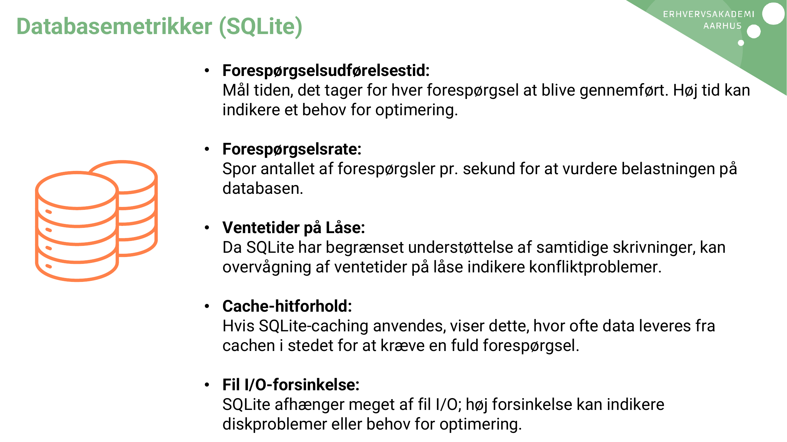
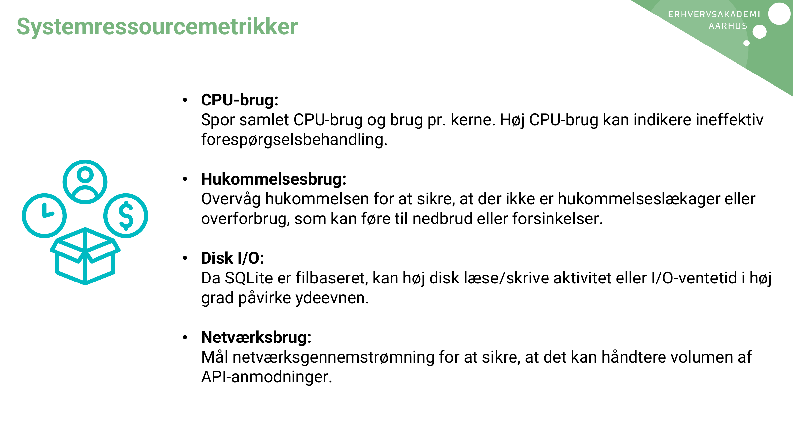
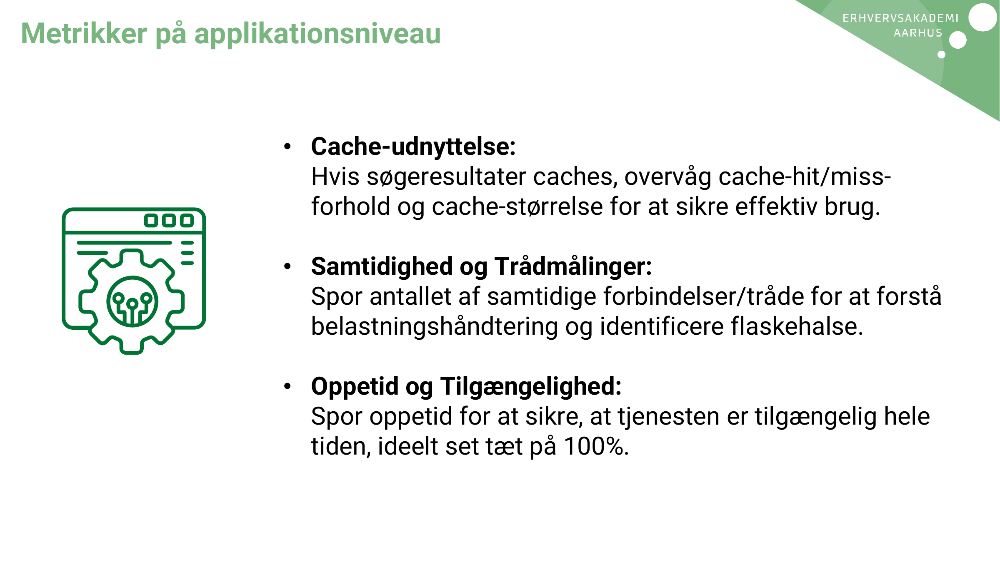
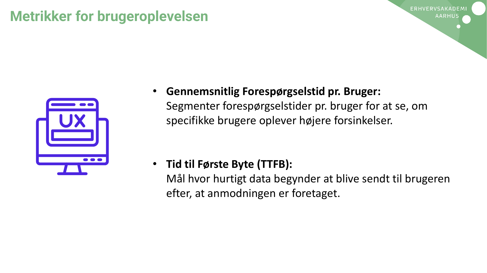
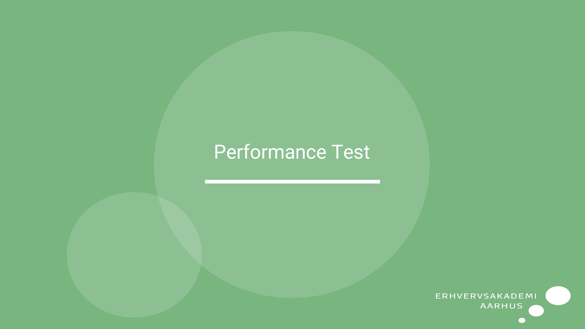
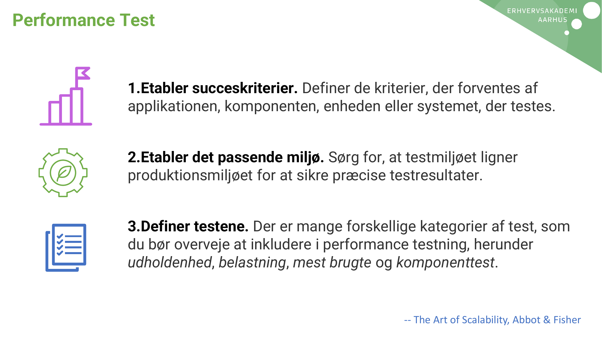
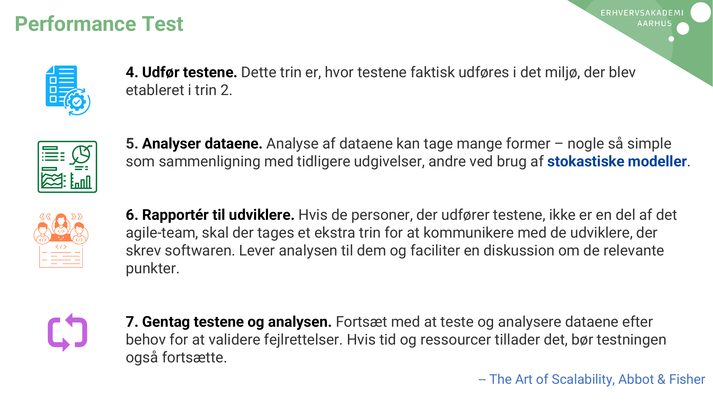
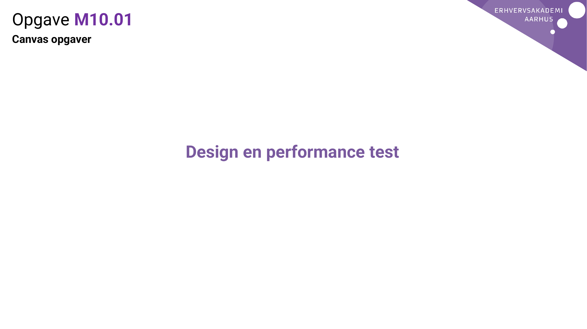

