# AI Extract: Emne - Splitting Databases.pdf

- Kilde: `Emne - Splitting Databases.pdf`
- Type: `pdf`
- Artefakter: tekst + sidebilleder

## Tekst

```text
Splitting Databases
Arkitekt Principper i Operations
AKF Database Scale Cube
Biased data

 I forbindelse med databaseopdeling, refererer biased data til data, der er
 organiseret eller segmenteret, baseret på specifikke karakteristika, temaer eller
 relationer.

 For eksempel:

 • Y-akse bias: Data grupperes efter funktionalitet eller ressourcetype (f.eks. kundedata vs.
   produktdata), i overensstemmelse med specifikke applikationsoperationer eller temaer.

 • Z-akse bias: Data opdeles baseret på opslagsværdier eller kriterier som kundegeografi eller
   en hashfunktion, uden hensyntagen til indholdets tematiske relationer.


 I modsætning hertil klones unbiased data (f.eks. i x-akseopdelinger) fuldt ud
 uden segmentering eller organisation baseret på sådanne karakteristika, hvilket
 sikrer ensartet duplikering på tværs af alle noder.
Opdeling af database: X-Axis


                  At opdele en database langs x-aksen betyder at skabe
                  identiske replikaer af hele databasen for at distribuere
                  læseoperationer og håndtere høje transaktionsbelastninger.

                  Data klones uden bias, hvilket sikrer eventuel konsistens på
                  tværs af knuder, med skrivninger rettet til en enkelt "master"
                  for at opretholde ACID-egenskaberne.

                  Det er en ligetil tilgang for at skalere transaktionsrater, men
                  adresserer ikke datavækst.
X-Axis Splitting

 Fordele:                                           Ulemper:
• Bedre læseskalerbarhed: Flere replikaer deler
                                                    • Begrænset skalerbarhed: Hele datasættet
  læsebelastningen.
                                                      kopieres til hver replika.
• Øget tilgængelighed: Andre replikaer tager over
                                                    • Forsinket replikering: Ændringer opdateres
  ved fejl.
                                                      ikke straks.
• Nem opsætning: Hurtigere end y- eller z-
                                                    • Skrive-flaskehals: Kun primær database
  aksedelinger.
                                                      håndterer skrivninger.
• Ens data på alle noder: Samme datasæt på alle
                                                    • Højt ressourceforbrug: Kræver ekstra
  replikaer.
                                                      kapacitet.
• God til læsetunge systemer: Perfekt ved mange
                                                    • Ingen fejlisolering: Fejl påvirker alle
  læseforespørgsler.
                                                      replikaer.
Opdeling af database: Y-Axis


                   At opdele en database langs y-aksen betyder at opdele
                   databasen i funktionelle eller tematiske segmenter baseret
                   på betydning, brug eller ressourcer (f.eks. kundedata,
                   produktdata).

                   Hvert segment fungerer uafhængigt, hvilket reducerer
                   kompleksitet og konflikter og er ofte tilpasset specifikke
                   applikationsfunktioner.

                   Denne tilgang hjælper med at styre datavækst og
                   kompleksitet, men kræver en betydelig udviklingsindsats.
Y-Axis Splitting

Fordele:                                                Ulemper:

• Mindre kompleksitet: Data opdeles i temaer.           • Høje omkostninger: Kræver omfattende
                                                          arbejde med data og kode.
• Bedre fejlisolering: Ét segments fejl påvirker ikke
  andre.                                                • Begrænset skalerbarhed: Få segmenter
                                                          løser ikke stor vækst.
• Skræddersyet optimering: Segmenter kan
  optimeres individuelt.                                • Øget kompleksitet: Flere databaser skal
                                                          driftes.
• Skalerer med kompleksitet: Belastning fordeles
  på flere skemaer/databaser.                           • Dataoverlap: Risiko for duplikering og
                                                          synkroniseringsproblemer.
• Støtter teamarbejde: Teams kan arbejde
  uafhængigt.                                           • Svær migration: Vanskelig overgang fra
                                                          monolit til segmentering.
Split af database: Z-Axis


                    At opdele en database langs z-aksen betyder opdeling af
                    data baseret på opslagsværdier eller kriterier, såsom
                    kundeplacering eller et hash af et ressource ID.

                    Hvert segment (eller shard) indeholder unikke data, der
                    sikrer afbalanceret belastningsfordeling og skalerbarhed.

                    Denne tilgang reducerer konflikter og understøtter høj
                    transaktions- og datavækst, men kræver yderligere
                    mekanismer til at dirigere anmodninger til det relevante
                    shard.
Z-Axis Splitting

Fordele:                                        Ulemper:

• Håndterer store datamængder gennem            • Kompleks routing til rigtige shards.
  opdeling.
                                                • Tunge tvær-shard forespørgsler kan
• Balanceret belastning via hashing/modulus.      hæmme performance.

• Øget robusthed med fejlisolering.             • Kræver mere drift og overvågning.

• Bedre performance via geografisk placering.   • Dyr datamigrering ved rebalancering.

• Fleksibel skalering af enkelte shards.        • Stor planlægningsindsats ved opstart.
PostgreSQL med replikaer
Opgave M12.01
Canvas opgaver


                 Postgres med read replicas i K8s

```

## Sider som billeder

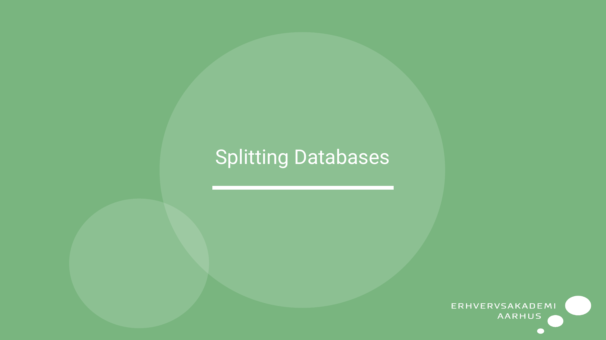
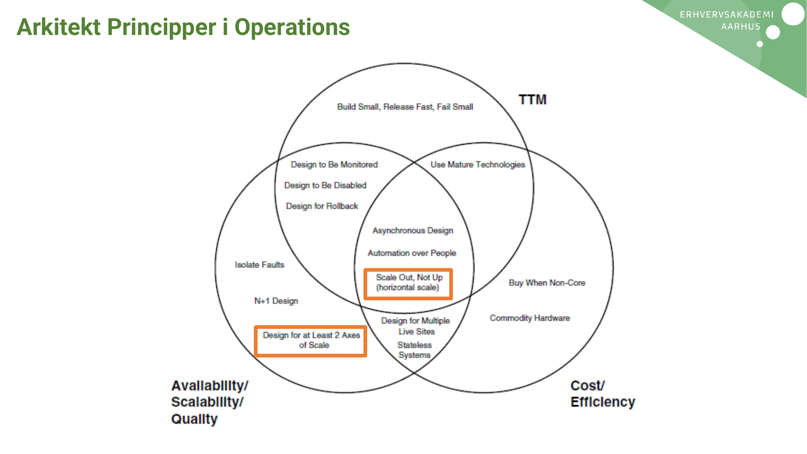
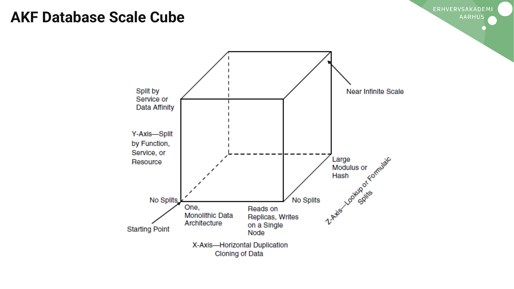
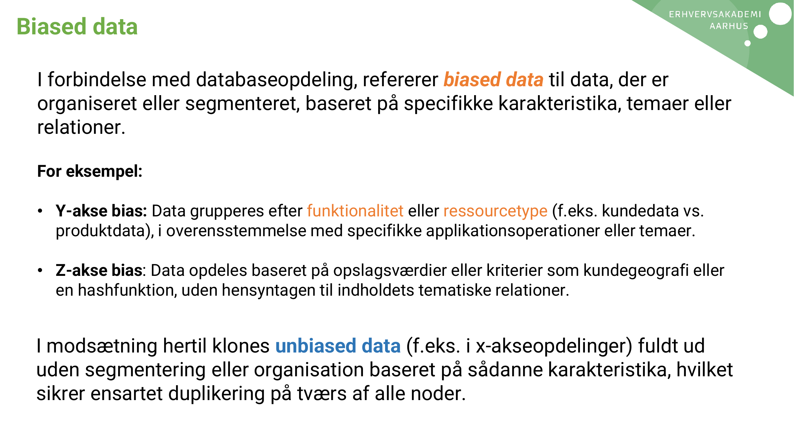
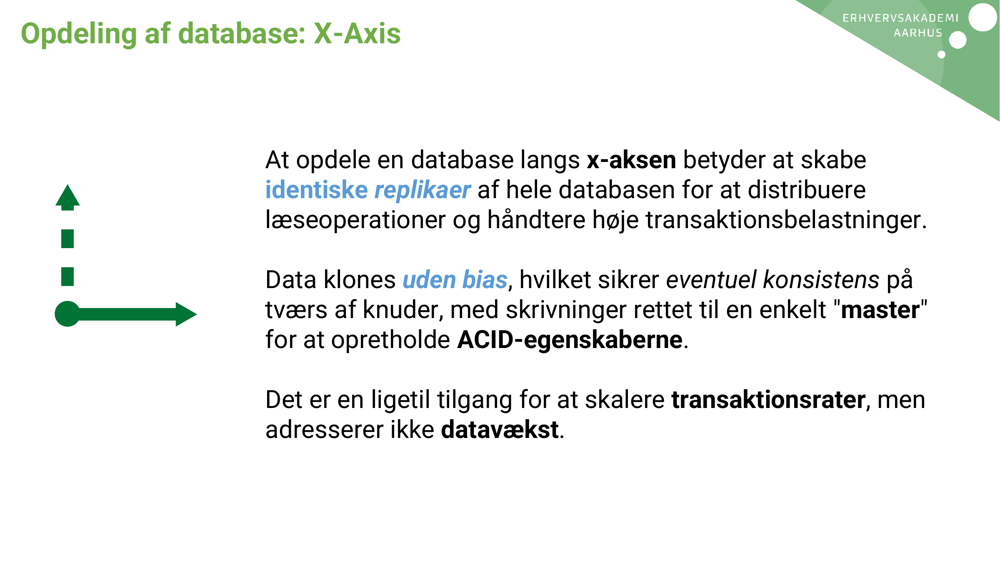
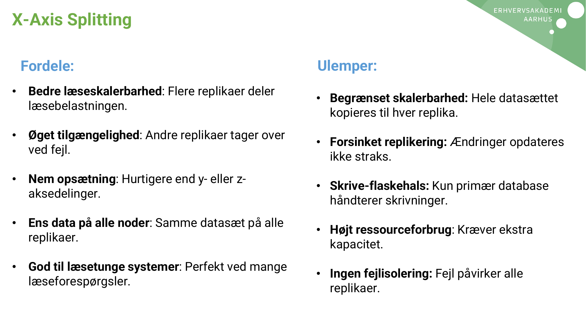
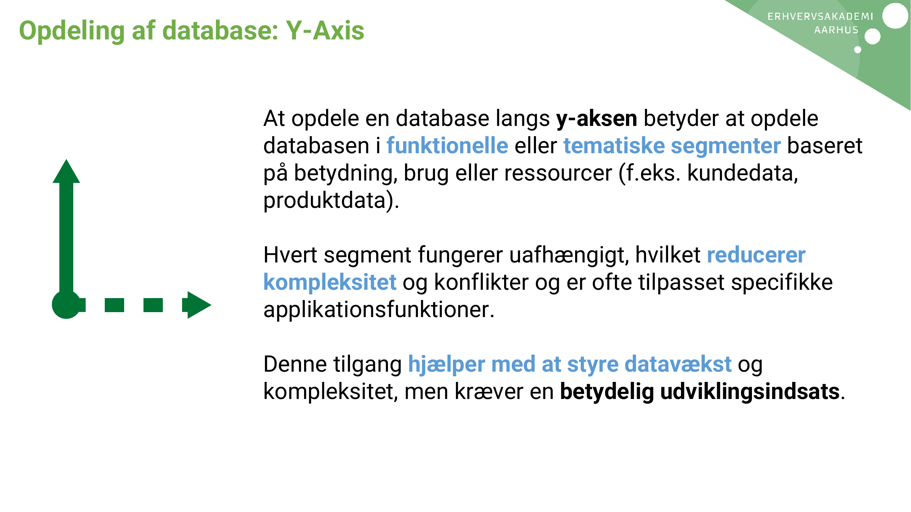
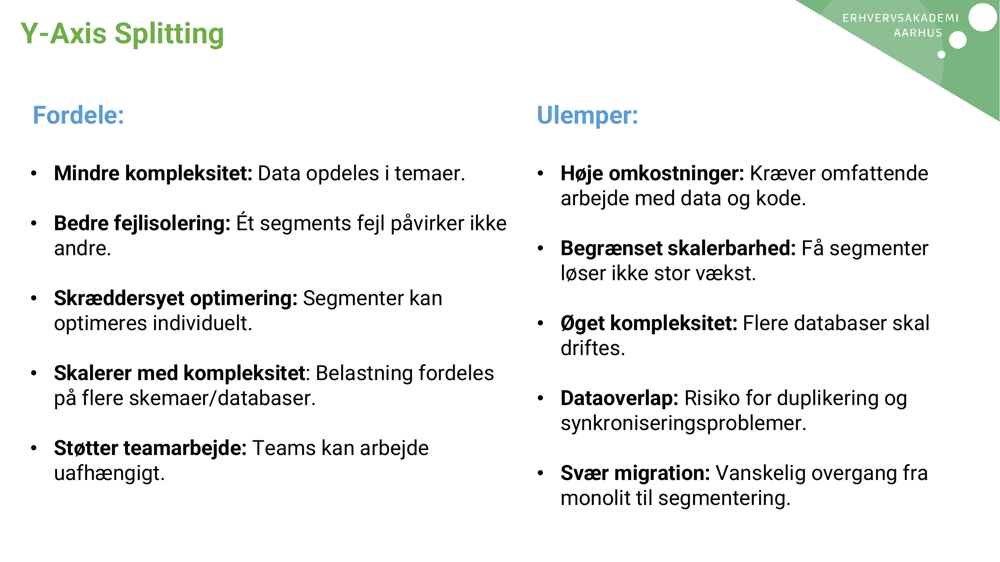
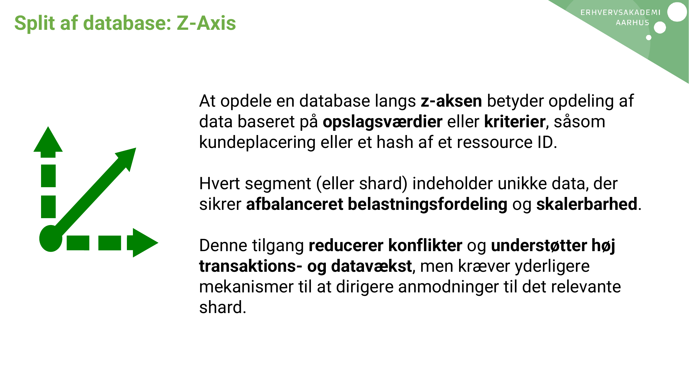
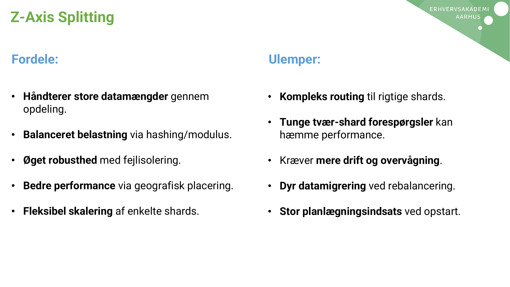
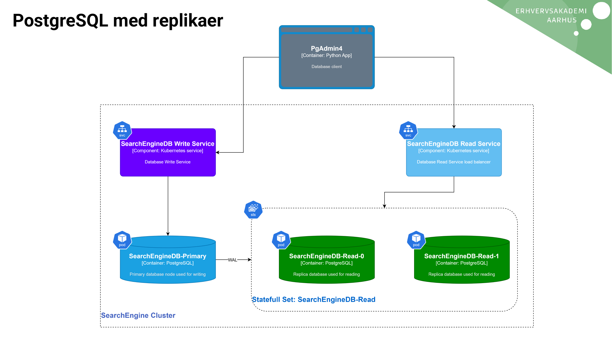
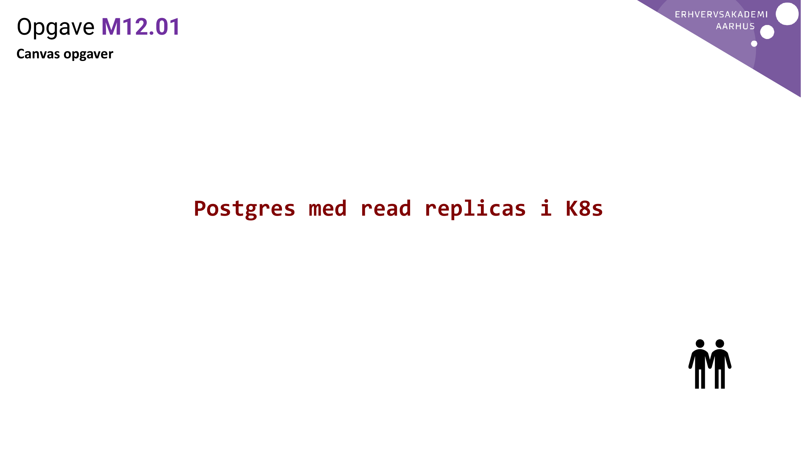

