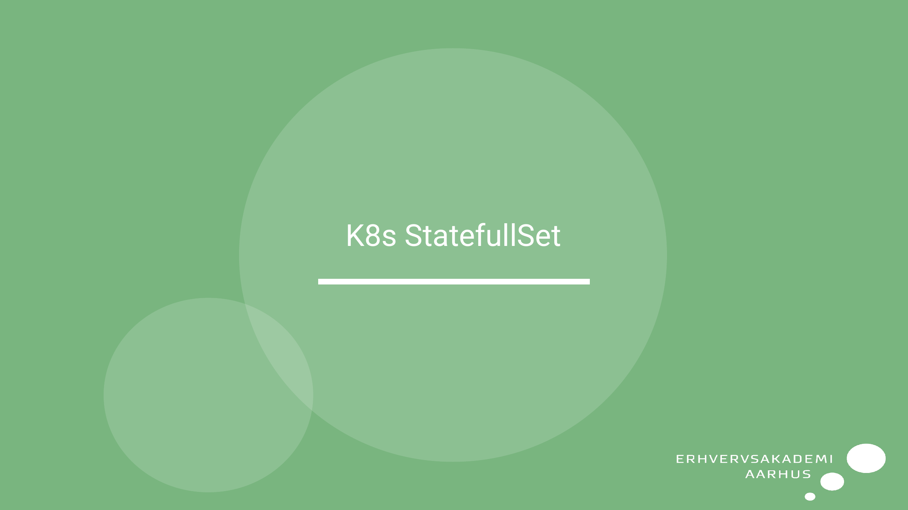
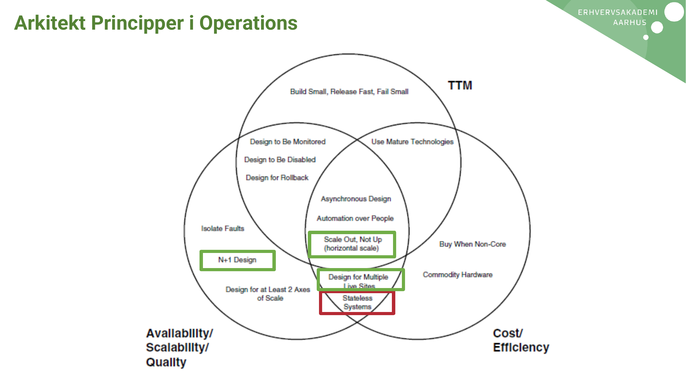
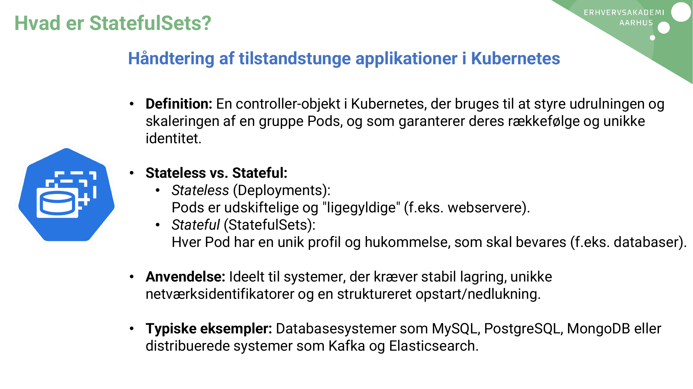
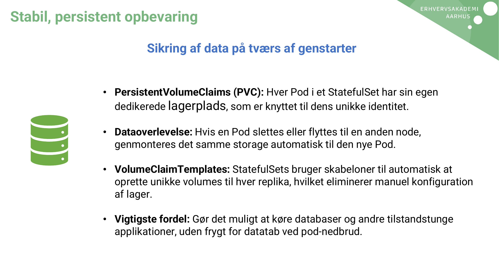
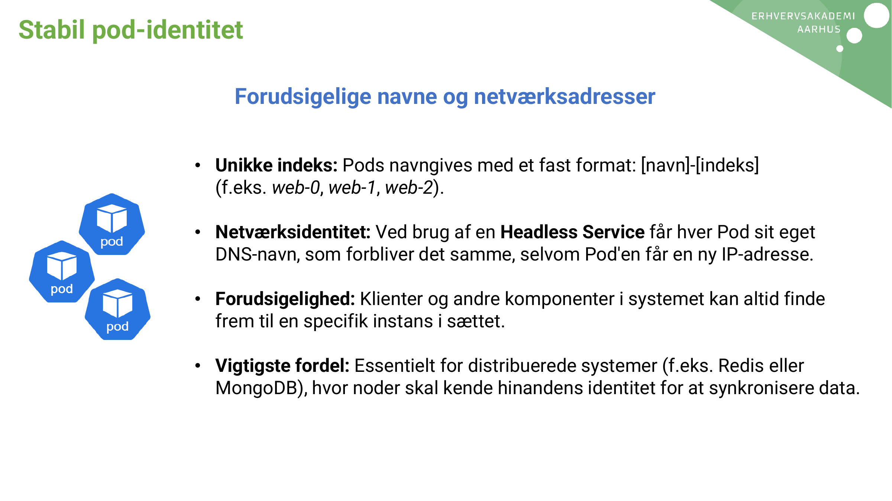
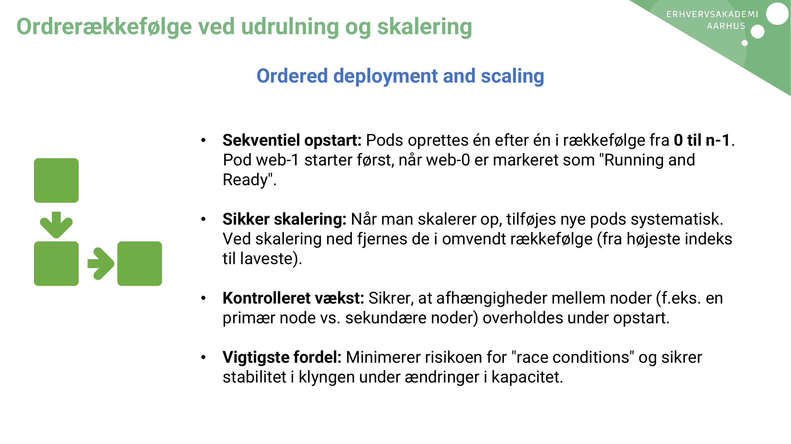
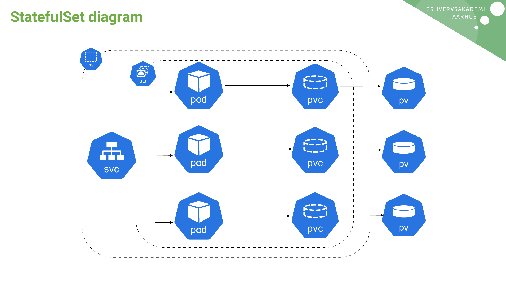

# AI Extract: Emne - StatefullSet.pdf

- Kilde: `Emne - StatefullSet.pdf`
- Type: `pdf`
- Artefakter: tekst + sidebilleder

## Tekst

```text
K8s StatefullSet
Arkitekt Principper i Operations
Hvad er StatefulSets?
            Håndtering af tilstandstunge applikationer i Kubernetes

            • Definition: En controller-objekt i Kubernetes, der bruges til at styre udrulningen og
              skaleringen af en gruppe Pods, og som garanterer deres rækkefølge og unikke
              identitet.

            • Stateless vs. Stateful:
               • Stateless (Deployments):
                  Pods er udskiftelige og "ligegyldige" (f.eks. webservere).
               • Stateful (StatefulSets):
                  Hver Pod har en unik profil og hukommelse, som skal bevares (f.eks. databaser).

            • Anvendelse: Ideelt til systemer, der kræver stabil lagring, unikke
              netværksidentifikatorer og en struktureret opstart/nedlukning.

            • Typiske eksempler: Databasesystemer som MySQL, PostgreSQL, MongoDB eller
              distribuerede systemer som Kafka og Elasticsearch.
Stabil, persistent opbevaring

                       Sikring af data på tværs af genstarter


              • PersistentVolumeClaims (PVC): Hver Pod i et StatefulSet har sin egen
                dedikerede lagerplads, som er knyttet til dens unikke identitet.

              • Dataoverlevelse: Hvis en Pod slettes eller flyttes til en anden node,
                genmonteres det samme storage automatisk til den nye Pod.

              • VolumeClaimTemplates: StatefulSets bruger skabeloner til automatisk at
                oprette unikke volumes til hver replika, hvilket eliminerer manuel konfiguration
                af lager.

              • Vigtigste fordel: Gør det muligt at køre databaser og andre tilstandstunge
                applikationer, uden frygt for datatab ved pod-nedbrud.
Stabil pod-identitet

                   Forudsigelige navne og netværksadresser


               • Unikke indeks: Pods navngives med et fast format: [navn]-[indeks]
                 (f.eks. web-0, web-1, web-2).

               • Netværksidentitet: Ved brug af en Headless Service får hver Pod sit eget
                 DNS-navn, som forbliver det samme, selvom Pod'en får en ny IP-adresse.

               • Forudsigelighed: Klienter og andre komponenter i systemet kan altid finde
                 frem til en specifik instans i sættet.

               • Vigtigste fordel: Essentielt for distribuerede systemer (f.eks. Redis eller
                 MongoDB), hvor noder skal kende hinandens identitet for at synkronisere data.
Ordrerækkefølge ved udrulning og skalering

                       Ordered deployment and scaling


                • Sekventiel opstart: Pods oprettes én efter én i rækkefølge fra 0 til n-1.
                  Pod web-1 starter først, når web-0 er markeret som "Running and
                  Ready".

                • Sikker skalering: Når man skalerer op, tilføjes nye pods systematisk.
                  Ved skalering ned fjernes de i omvendt rækkefølge (fra højeste indeks
                  til laveste).

                • Kontrolleret vækst: Sikrer, at afhængigheder mellem noder (f.eks. en
                  primær node vs. sekundære noder) overholdes under opstart.

                • Vigtigste fordel: Minimerer risikoen for "race conditions" og sikrer
                  stabilitet i klyngen under ændringer i kapacitet.
StatefulSet diagram


           ns


                      sts


                            pod   pvc   pv


                            pod   pvc   pv
                svc


                            pod   pvc   pv

```

## Sider som billeder









