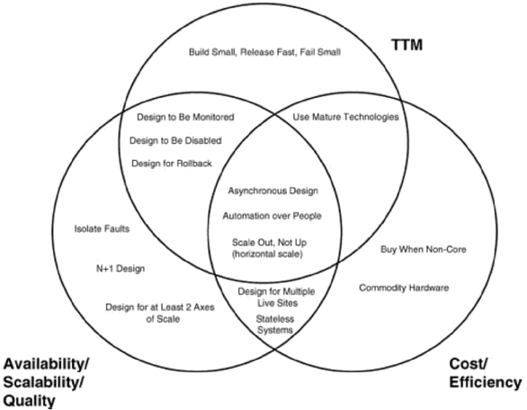
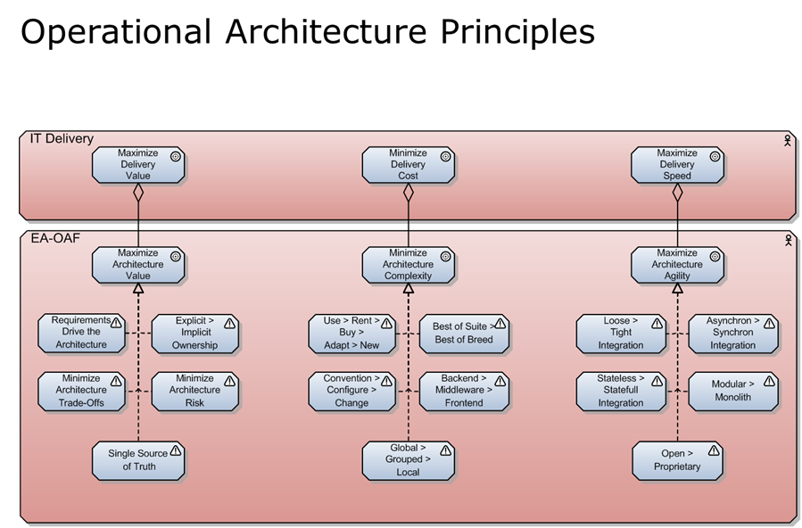

# AI Extract: Modul 1 - intro til ark principper.pptx

- Kilde: `Modul 1 - intro til ark principper.pptx`
- Type: `pptx`
- Indhold: udtraek af slide-tekst + indlejrede billeder

## Slide 1

- Arkitektur principper
- Hvad er det og hvorfor har vi dem?
- Overblik
- Kriterier
- Eksempel

## Slide 2

- Hvad er arkitektur principper og hvorfor have dem?
- Best-practice og guidelines for arkitekter
- Det kan være svar på hvordan man vil håndtere specielle krav eller omstændigheder i et projekt
- Principperne er nemme at forstå og kan være dyre at følge – eller ikke følge
- Tænk på dem som en checkliste
- De kan skabe stor værdi under udviklingen og i produktet
- AKF principperne er kun eksempler

## Slide 3

- Overblik

## Slide 4

- Vigtige arkitektur principper
- Scale
- out – not up!
- Stateless
- systems
- asynchronous
- design
- Design to
- be
- monitored
- Design to
- be
- disabled

## Slide 5

- Hvordan defineres nye arkitektur principper?
- Man kan bruge ”smart” kriteriet:
- S
- pecific
- M
- easurable
- A
- chievable
- R
- ealistic
- T
- estable
- Derudover skal modsætningen give mening…

## Slide 6

- Eksempel

## Slide 7

- Husk…
- AFK principperne kan bruges som en checkliste i starten af et projekt
- Nogle principper er vigtige for udviklere, nogle er vigtige for operation/drift og nogle er vigtige for begge.
- Arkitekten vælger arkitektur principper fra eller til i et givet projekt.
- I kan selv definere jeres egne principper

