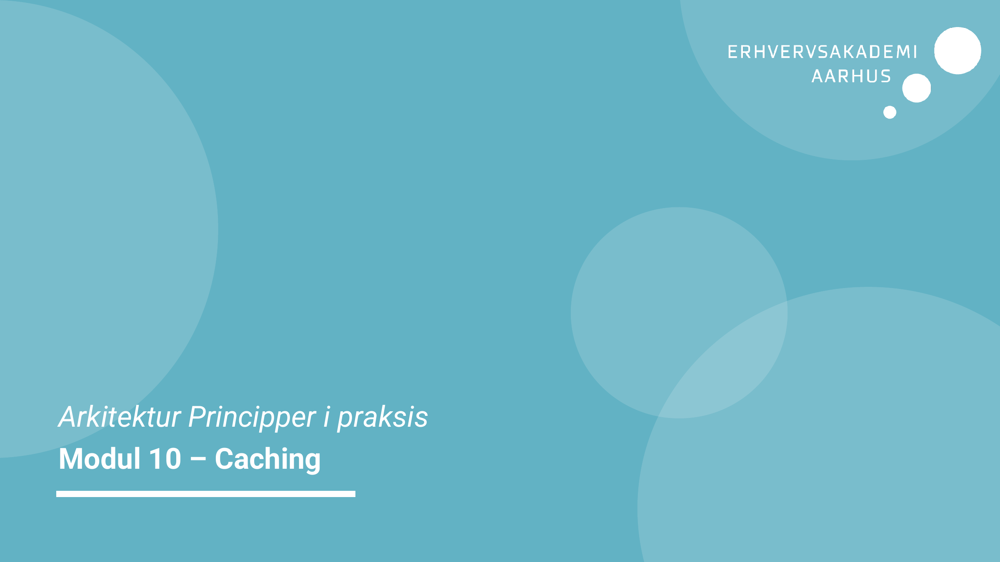
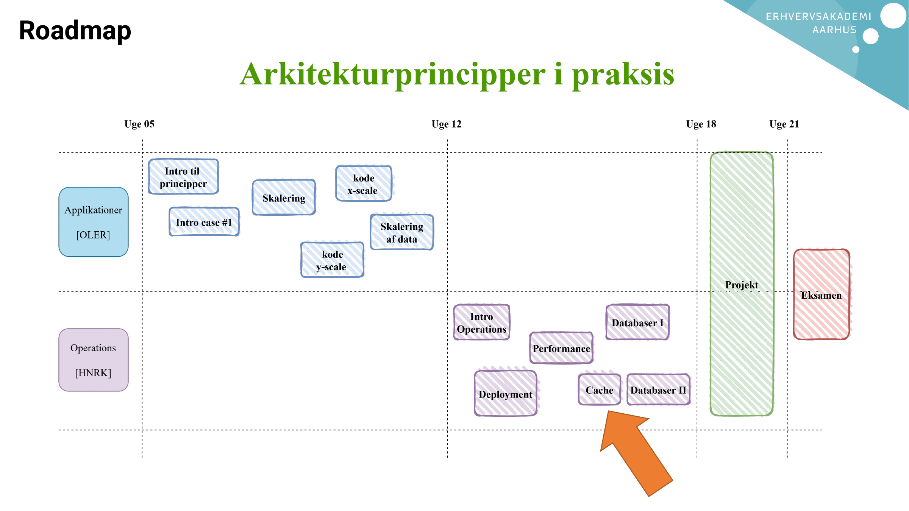
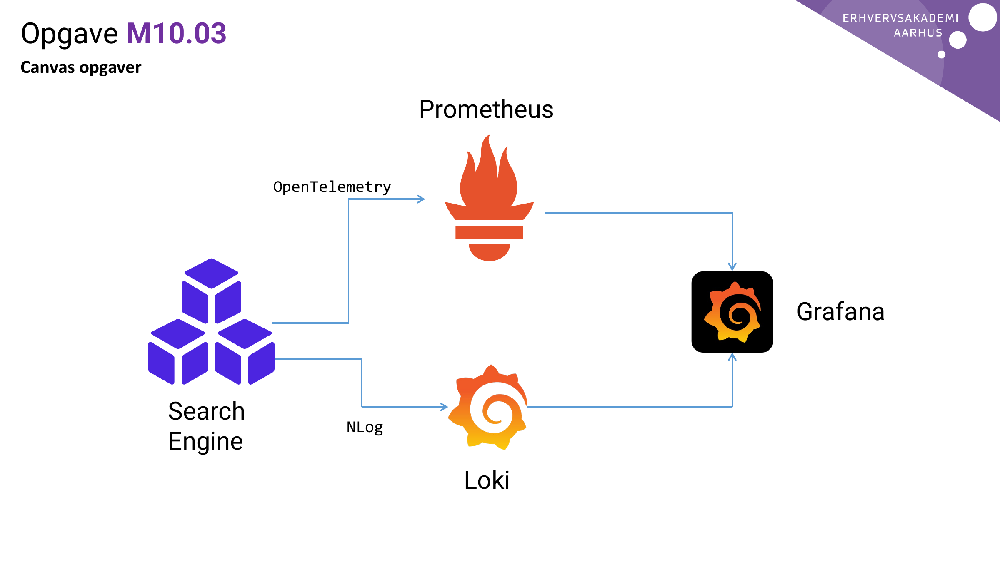
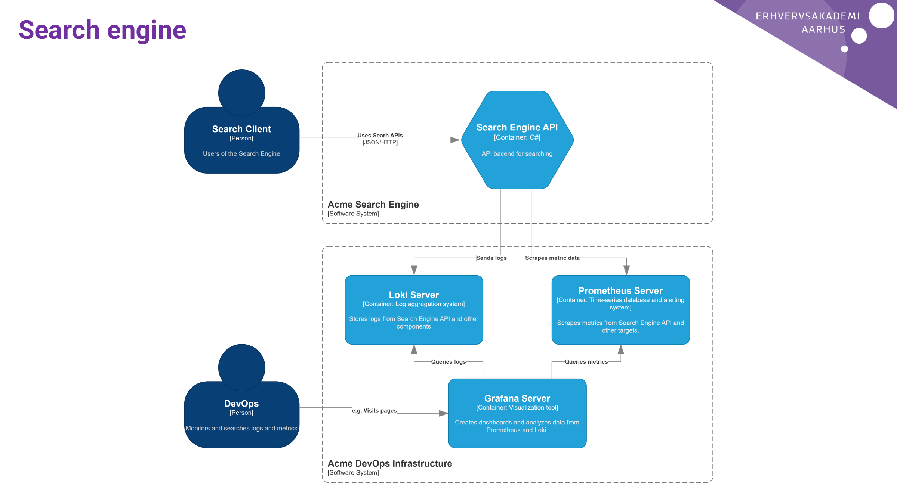
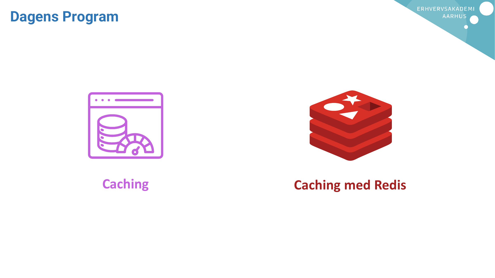
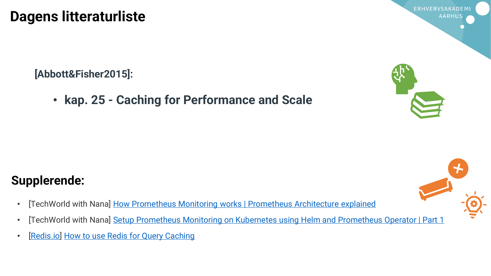
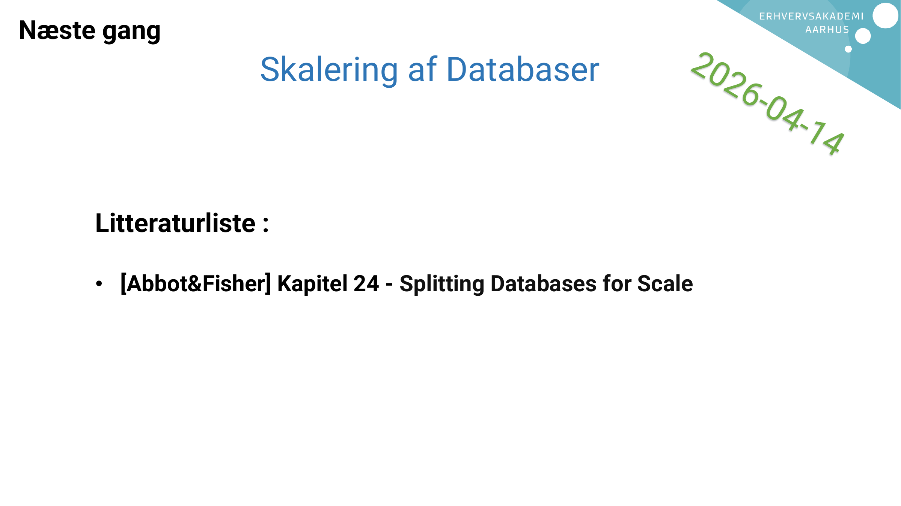

# AI Extract: Modul 10 - Caching.pdf

- Kilde: `Modul 10 - Caching.pdf`
- Type: `pdf`
- Artefakter: tekst + sidebilleder

## Tekst

```text
Arkitektur Principper i praksis
Modul 10 – Caching
Roadmap
Opgave M10.03
Canvas opgaver

                                          Prometheus

                          OpenTelemetry


                                                       Grafana


                 Search           NLog
                 Engine
                                             Loki
Search engine
Dagens Program


           Caching   Caching med Redis
Dagens litteraturliste


      [Abbott&Fisher2015]:

           • kap. 25 - Caching for Performance and Scale


Supplerende:
 •   [TechWorld with Nana] How Prometheus Monitoring works | Prometheus Architecture explained
 •   [TechWorld with Nana] Setup Prometheus Monitoring on Kubernetes using Helm and Prometheus Operator | Part 1
 •   [Redis.io] How to use Redis for Query Caching
Afrunding
Næste gang
                     Skalering af Databaser


     Litteraturliste :

     • [Abbot&Fisher] Kapitel 24 - Splitting Databases for Scale

```

## Sider som billeder










