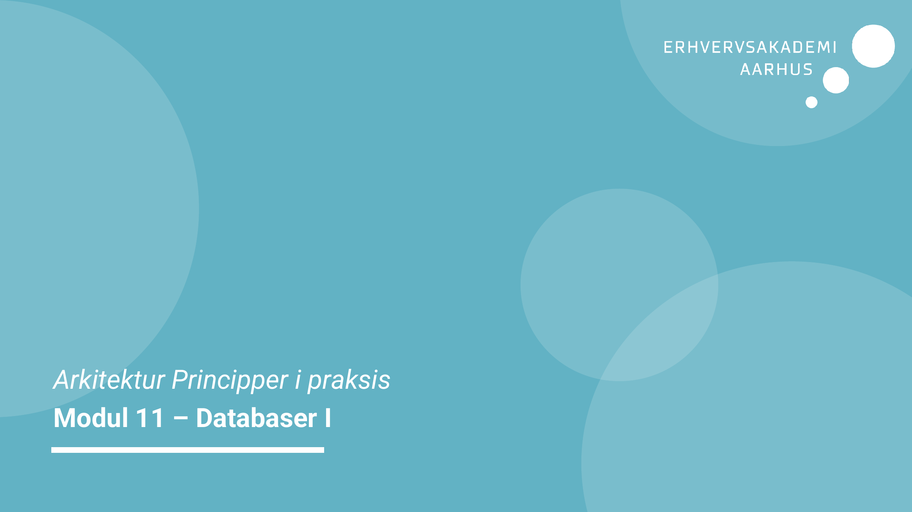
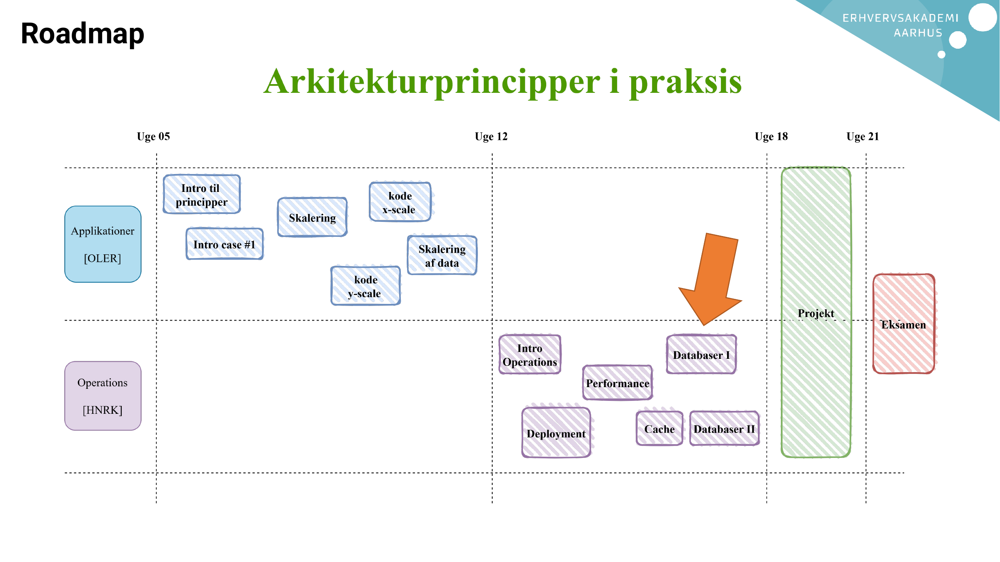
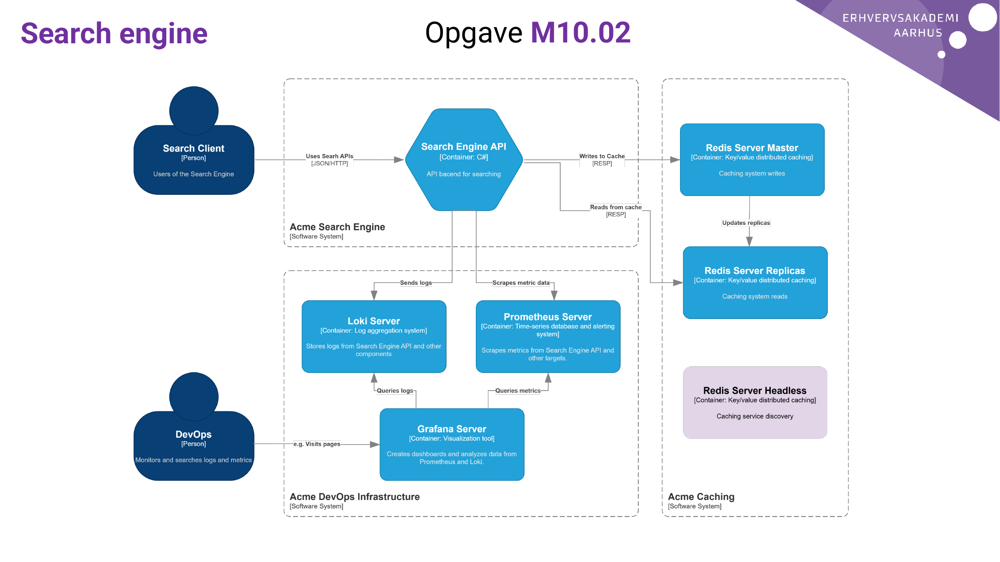
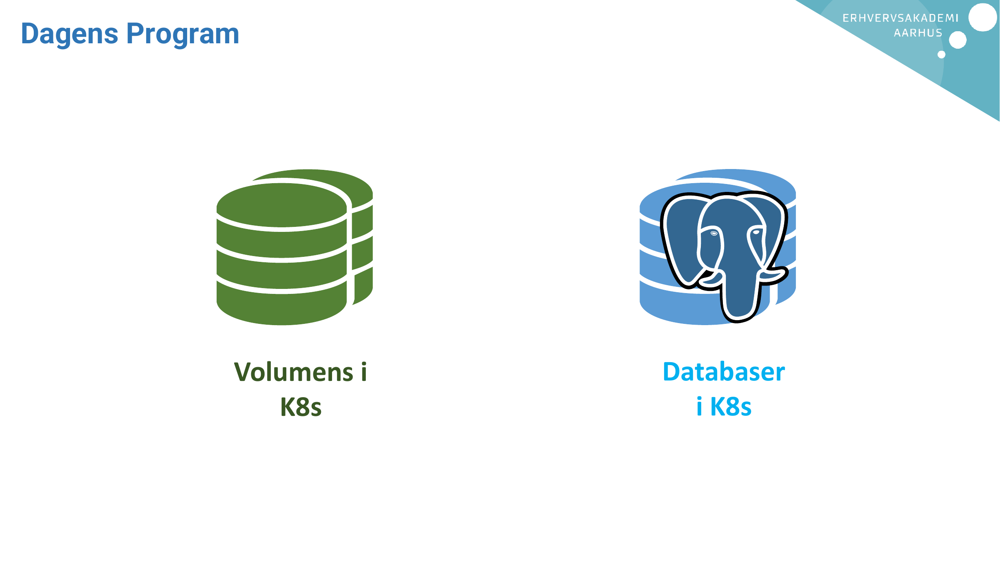
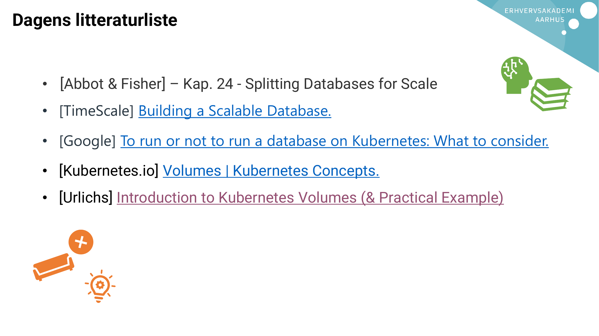

# AI Extract: Modul 11 - Databaser.pdf

- Kilde: `Modul 11 - Databaser.pdf`
- Type: `pdf`
- Artefakter: tekst + sidebilleder

## Tekst

```text
Arkitektur Principper i praksis
Modul 11 – Databaser I
Roadmap
Search engine   Opgave M10.02
Dagens Program


             Volumens i   Databaser
                K8s         i K8s
Dagens litteraturliste


   • [Abbot & Fisher] – Kap. 24 - Splitting Databases for Scale
   • [TimeScale] Building a Scalable Database.

   • [Google] To run or not to run a database on Kubernetes: What to consider.

   • [Kubernetes.io] Volumes | Kubernetes Concepts.
   • [Urlichs] Introduction to Kubernetes Volumes (& Practical Example)

```

## Sider som billeder







