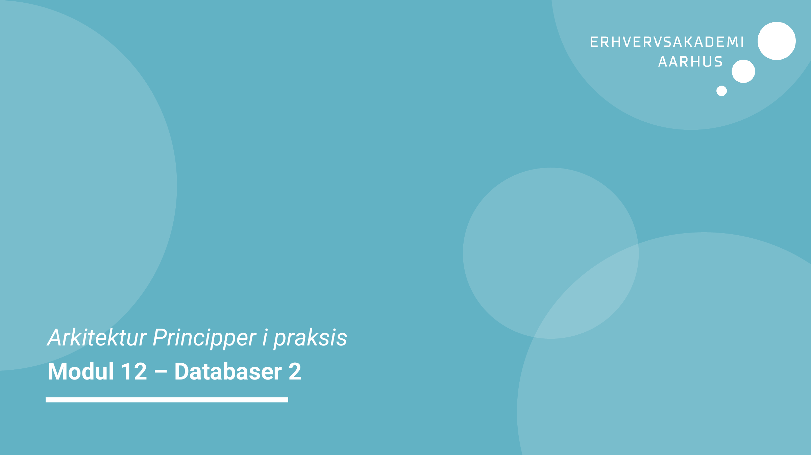
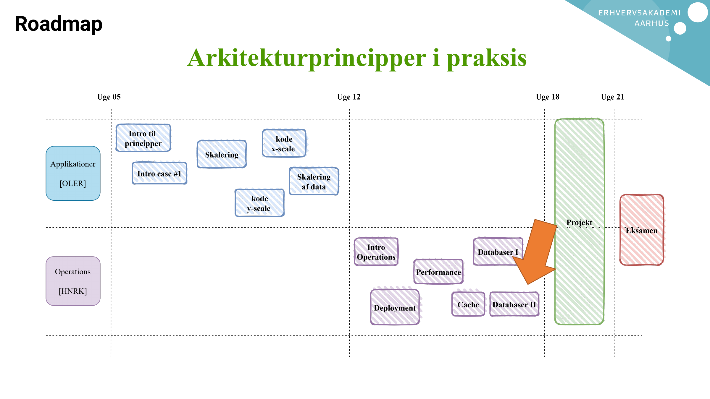
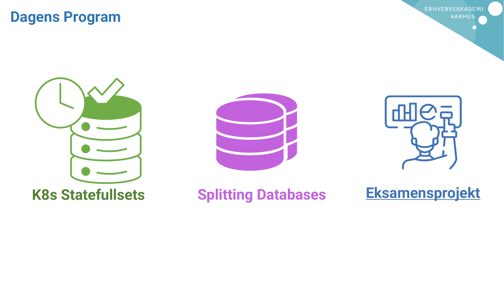
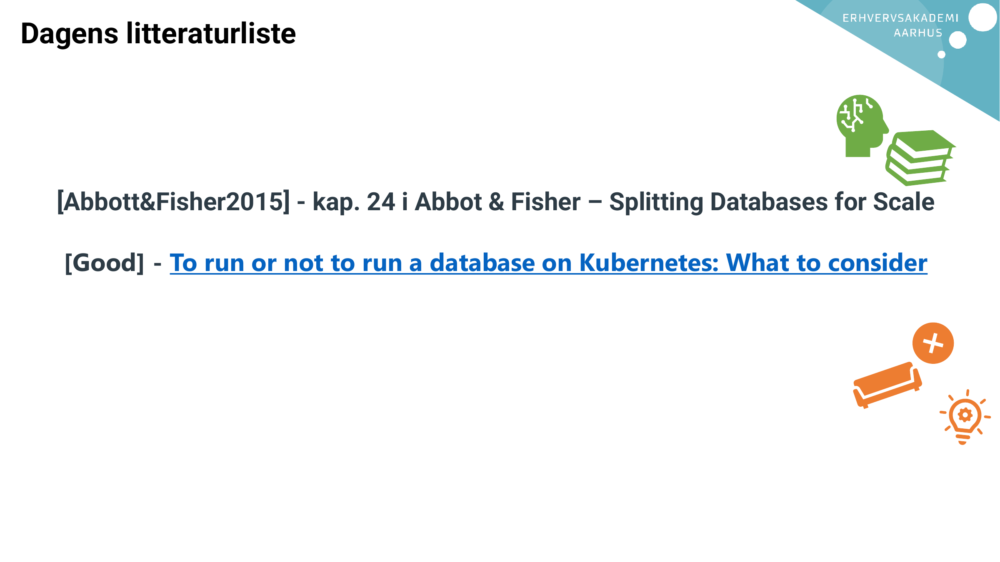

# AI Extract: Modul 12 - Databaser 2.pdf

- Kilde: `Modul 12 - Databaser 2.pdf`
- Type: `pdf`
- Artefakter: tekst + sidebilleder

## Tekst

```text
Arkitektur Principper i praksis
Modul 12 – Databaser 2
Roadmap
Dagens Program


  K8s Statefullsets   Splitting Databases   Eksamensprojekt
Dagens litteraturliste


  [Abbott&Fisher2015] - kap. 24 i Abbot & Fisher – Splitting Databases for Scale

   [Good] - To run or not to run a database on Kubernetes: What to consider

```

## Sider som billeder






