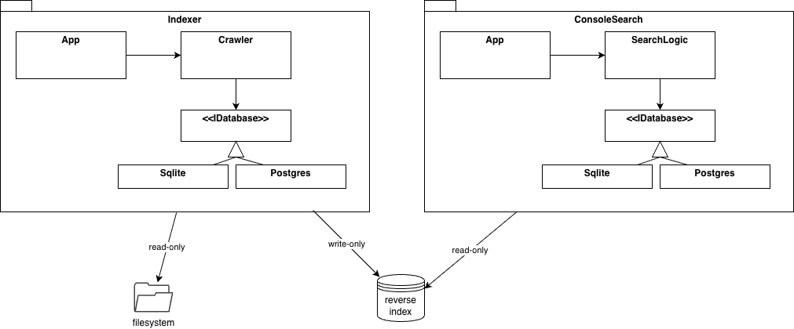
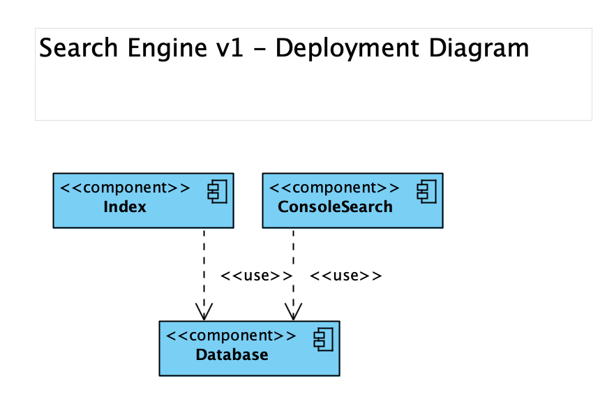
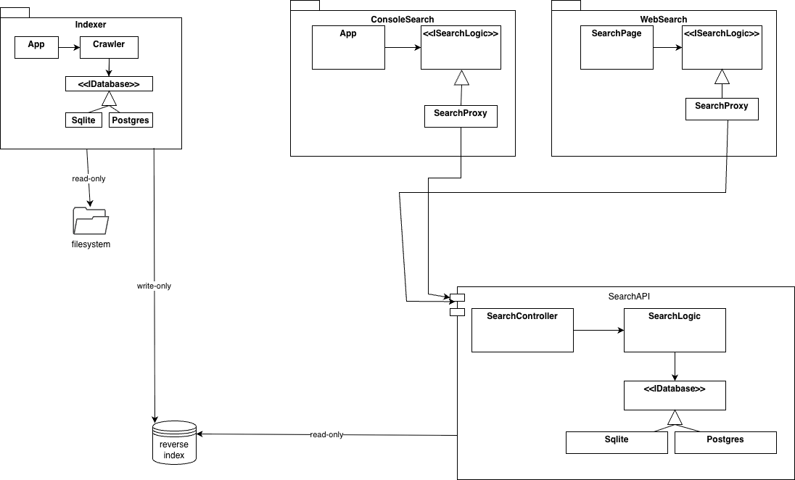

# AI Extract: Modul 2 - intro case.pptx

- Kilde: `Modul 2 - intro case.pptx`
- Type: `pptx`
- Indhold: udtraek af slide-tekst + indlejrede billeder

## Slide 1

- Intro til case – en intern søgemaskine
- Kontekst og krav
- Brugerfladen
- Indeksering og datamodel
- Arkitektur
- Walking
- Skeleton

## Slide 2

- Kontekst
- En virksomhed/organisation med 50++ ansatte, som arbejder med og producerer dokumenter
- Dokumenter indeholder ustruktureret data og findes i mange formater (docx, pdf, rtf,
- txt
- ,
- csv
- ,
- pptx
- ,
- xlxs
- osv.)
- Den samlede dokument samling er allokeret på mange fil servere på tilsammen flere
- terra
- -bytes.
- Behovet er et søgesystem, som tilbyder “
- instant
- content
- search
- ” og som kan tilpasses domænet.

## Slide 3

- Brugergrænsefladen
- Brugergrænsefladen kan være en web applikation eller en desktop applikation.
- Web applikationen vil være begrænset til intranettet.
- En desktop applikation skal installeres på alle computere.
- Brugeren vil have en Google-like brugerflade, hvor
- der indtastes søgeord (
- query
- )
- Resultatet er en liste af hits med titel, link, dato, score og
- snippet
- .

## Slide 4

- Specielle Krav
- 100%
- recall
- – det betyder, at alle dokumenter, som indeholder mindst et af søgeordene, skal med i resultatet.
- Rankeringen
- skal være med aftagene score.
- Givet en søgning og et dokument, så er scoren et tal mellem 0 og 1.
- 0 hvis ingen af søgeordene er i dokumentet
- 1 hvis alle søgeordene er i dokumentet.
- Hvis x% af søgeordene er i dokumentet, så er scoren x/100.

## Slide 5

- Tilpasse domæne
- Hvert domæne (ingeniør, forsikring, politi,
- meteologi
- …) har nogle specifikke betegnelser/slang.
- Det skal være muligt at søge efter (domæne specifikke) synonymer.
- Dette kan gøres ved, at søgemaskinen gør brug af en domæne specifik synonym ordbog (
- termnet
- ), således at der også søges på synonymer.
- Det konkrete indhold af synonym ordbogen kan vedligeholdes af brugerne (domænet).

## Slide 6

- Indeksering
- For at kunne udføre indholdssøgning i millioner af dokumenter effektivt, kan man indeksere dokumenterne.
- En indekser gennemlæser dokumenter (eng: crawl) og for hvert af disse vil det udtrække ord og danne et
- omvendt indeks
- .
- Et omvendt indeks tilbyder effektiv søgning for dokumenter som indeholder bestemte ord.

## Slide 7

- En begrebsmæssig datamodel for det omvendte indeks.
- Document
- Title
- Link
- Date
- Word
- value
- Occurrence
- *
- *
- Filsystemet kan hurtigt svare på hvilke ord et givet dokument indeholder.
- Behovet er dog hurtige svar på det omvendte:
- Hvilke dokumenter indeholder et givet ord?

## Slide 8

- En relationel datamodel for det omvendte indeks
- Document
- docId
- Title
- Link
- Date
- Term
- termId
- value
- Occurrence
- docId
- termId
- Heri
- kan
- placeres
- attributer
- som
- knytter
- sig
- til
- forekomst
- ,
- fx
- . position
- eller
- count

## Slide 9

- Walking
- Skeleton
- (version 1)
- Funktionalitet
- Søgningen
- er et konsol program indeholdende søgelogikken
- Ingen
- snippets
- Ingen synonym ordbog
- Indekser
- er et konsol program og kan indeksere filer og foldere i en folder
- Kan kun indeksere .
- txt
- dokumenter
- kan ikke opdatere – laver helt nyt indeks når den startes
- Databasen
- En simpel
- SQLite
- /
- Postgres
- database med 3 tabeller: Document, Word, og
- Occurrence
- .

## Slide 10

- Walking
- Skeleton
- (version 1)
- Arkitektur – class diagram

## Slide 11

- Walking
- Skeleton
- (version 1)
- Arkitektur -
- deployment

## Slide 12

- Arkitektur – version 2
- Search program
- Desktop
- Search Engine
- (API)
- Database
- Indexer
- File system
- Search program
- WebApp

## Slide 13

- Class diagram – version 2

