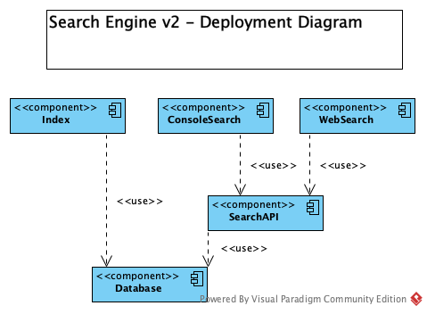

# AI Extract: Modul 3 - en roadmap for y-scale.pptx

- Kilde: `Modul 3 - en roadmap for y-scale.pptx`
- Type: `pptx`
- Indhold: udtraek af slide-tekst + indlejrede billeder

## Slide 1

- Skalering af kode
- En trinvis
- roadmap
- for y-skalering

## Slide 2

- Udgangspunkt
- A
- Koden i A - og de klasser den bruger -
- skal kunne tilgås via et API – på en
- anden computer/program.

## Slide 3

- Step 1: Indfør interface og
- factory
- A
- Nu er A isoleret og det er kun
- FactoryA
- der kender til A.
- <<IA>>
- FactoryA

## Slide 4

- Step 2: Kopier koden og byg et API
- A
- Nu er A tilgængelig via et API – kan testes med fx
- Postman
- <<IA>>
- FactoryA
- A
- API
- Controller
- +

## Slide 5

- Step 3: Lav en proxy der bruger
- API’et
- ProxyA
- <<IA>>
- FactoryA
- A
- API
- Controller
- +

## Slide 6

- Dagens opgave 1

