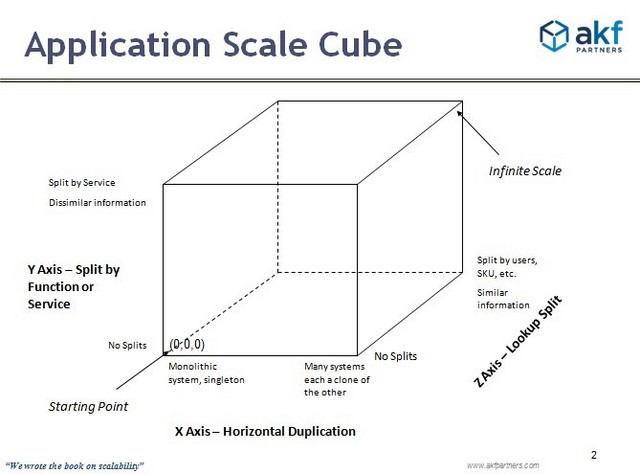
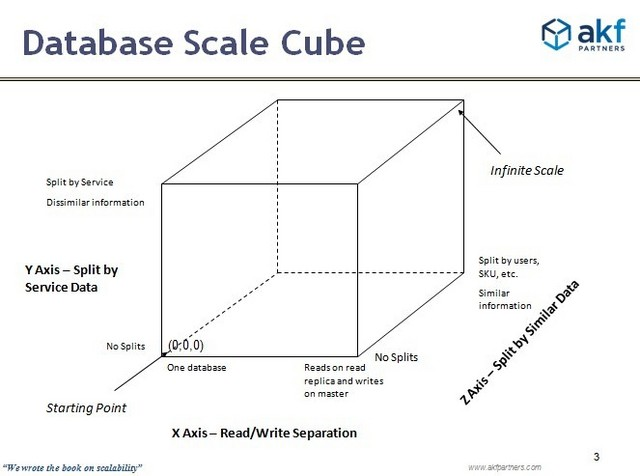

# AI Extract: Modul 3 - skalering.pptx

- Kilde: `Modul 3 - skalering.pptx`
- Type: `pptx`
- Indhold: udtraek af slide-tekst + indlejrede billeder

## Slide 1

- Skalering
- ”
- Scale
- out – not up!”
- Skaleringskuben – x, y, z
- Skalering af service/kode
- Skalering af data
- Eksempler

## Slide 2

- Skalering af service

## Slide 3

- De tre dimensioner – service
- X-
- scale
- : kloning, den samme service afvikles på flere computere. Pas på med tilstand.
- Loadbalancer
- Y-
- scale
- : Split kodebasen for en service, så den afvikles på flere computere.
- Tag en del af kodebasen og flyt over i et API.
- Z-
- scale
- : Split
- udfra
- kontekst af
- request
- En reception

## Slide 4

- Eksempel 1 – stateless Logic
- UI - webapp
- Logic - API
- Data - database

## Slide 5

- Eksempel – stateless Logic
- UI - webapp
- Logic - API
- Data - database
- Logic - API
- Loadbalancer
- - API
- X-
- skalering
- –
- usynlig
- for
- dem
- som
- bruger
- komponenten
- der x-
- skaleres

## Slide 6

- Eksempel 2 – stateful Logic
- UI - webapp
- Logic - API
- Data - database
- = data

## Slide 7

- Eksempel 2 - stateful Logic
- UI - webapp
- Data - database
- = data
- Data - API
- Logic - API
- Y-
- skalering
- – vi
- opdeler
- Logic
- så
- Data
- isoleres
- .
- Step 1: Lav
- en
- y-
- skalering

## Slide 8

- Eksempel 2 – stateful Logic
- UI - webapp
- Data - database
- Loadbalancer
- - API
- X-
- skalering
- –
- usynlig
- for
- dem
- som
- bruger
- komponenten
- der x-
- skaleres
- Data - API
- Logic - API
- Logic - API
- Step 2:
- Derefter
- -
- lav
- en
- x-
- skalering

## Slide 9

- Skalering af data / tilstand

## Slide 10

- De tre dimensioner - data
- X-
- scale
- : kloning, den samme database på flere computere.
- Read-sensitive applikationer
- Master-slave instanser…
- Y-
- scale
- : Split databasen, så den placeres på flere computere.
- Logon
- , ordrer, varelager
- På tabel eller feltniveau
- Z-
- scale
- : Split på række niveau
- Samme skema – forskelligt indhold.

## Slide 11

- Eksempel 3 – z-scale
- UI - webapp
- Logic - API
- Data - database
- Vi
- skal
- udvide
- til
- det
- svenske
- og
- tyske
- marked…

## Slide 12

- Eksempel 3 – z-scale
- UI - webapp
- Logic - API
- Data DK - database
- UI - webapp
- Logic - API
- Data GE - database
- UI - webapp
- Logic - API
- Data SE - database
- Reception – API
- Redirect

## Slide 13

- Resumé
- X er kloning – uden undtagelser
- Y er deling af kodebasen på flere services eller data på flere databaser
- Z er deling på
- request
- tidspunkt eller data af samme type.

