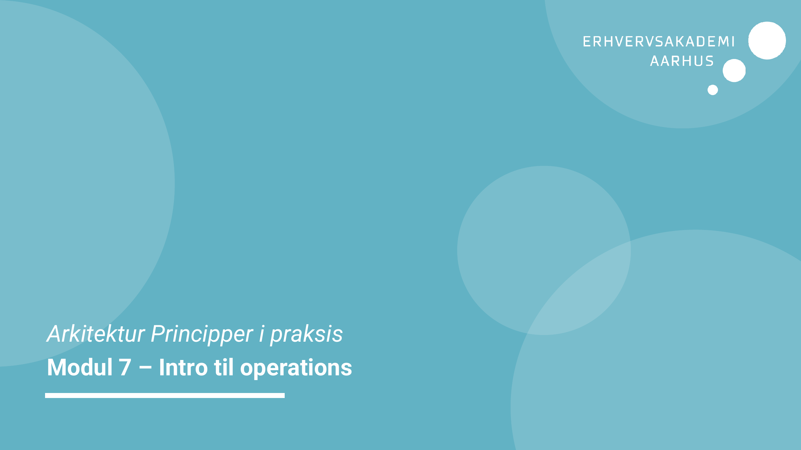
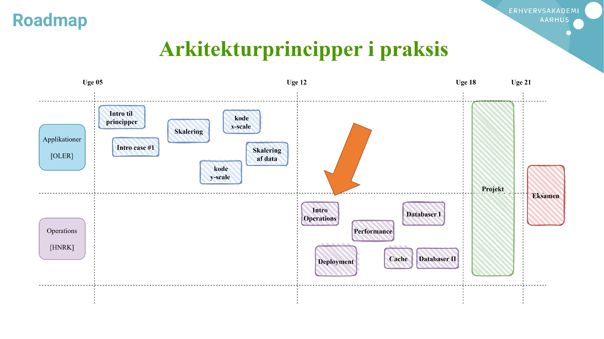
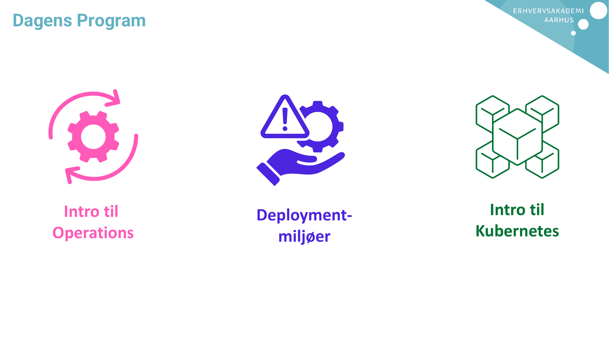
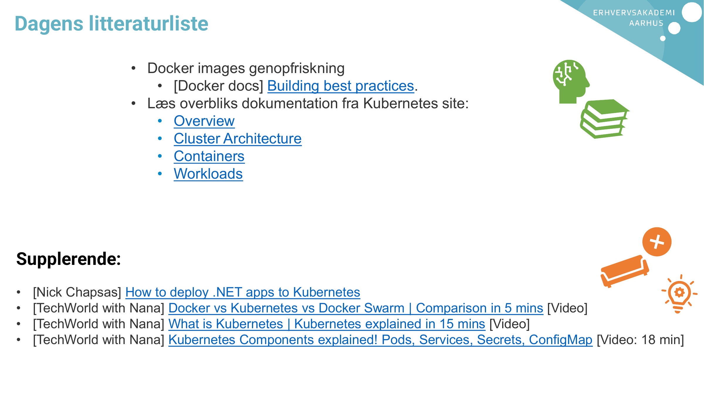
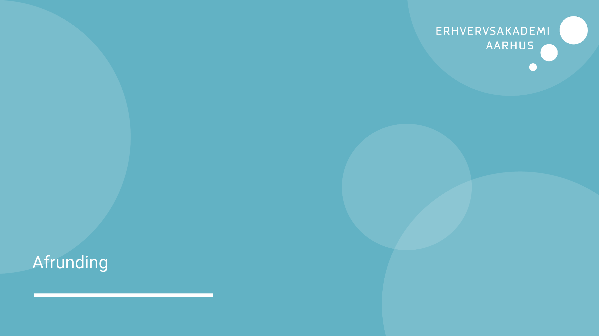
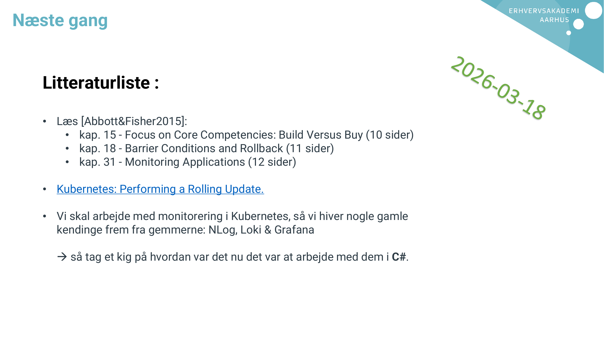

# AI Extract: Modul 7 - Intro til operations.pdf

- Kilde: `Modul 7 - Intro til operations.pdf`
- Type: `pdf`
- Artefakter: tekst + sidebilleder

## Tekst

```text
Arkitektur Principper i praksis
Modul 7 – Intro til operations
Roadmap
Dagens Program


     Intro til   Deployment-     Intro til
    Operations     miljøer     Kubernetes
Dagens litteraturliste

                   • Docker images genopfriskning
                      • [Docker docs] Building best practices.
                   • Læs overbliks dokumentation fra Kubernetes site:
                      • Overview
                      • Cluster Architecture
                      • Containers
                      • Workloads


Supplerende:
•   [Nick Chapsas] How to deploy .NET apps to Kubernetes
•   [TechWorld with Nana] Docker vs Kubernetes vs Docker Swarm | Comparison in 5 mins [Video]
•   [TechWorld with Nana] What is Kubernetes | Kubernetes explained in 15 mins [Video]
•   [TechWorld with Nana] Kubernetes Components explained! Pods, Services, Secrets, ConfigMap [Video: 18 min]
Afrunding
Næste gang


   Litteraturliste :

   • Læs [Abbott&Fisher2015]:
      • kap. 15 - Focus on Core Competencies: Build Versus Buy (10 sider)
      • kap. 18 - Barrier Conditions and Rollback (11 sider)
      • kap. 31 - Monitoring Applications (12 sider)

   • Kubernetes: Performing a Rolling Update.

   • Vi skal arbejde med monitorering i Kubernetes, så vi hiver nogle gamle
     kendinge frem fra gemmerne: NLog, Loki & Grafana

      så tag et kig på hvordan var det nu det var at arbejde med dem i C#.

```

## Sider som billeder








