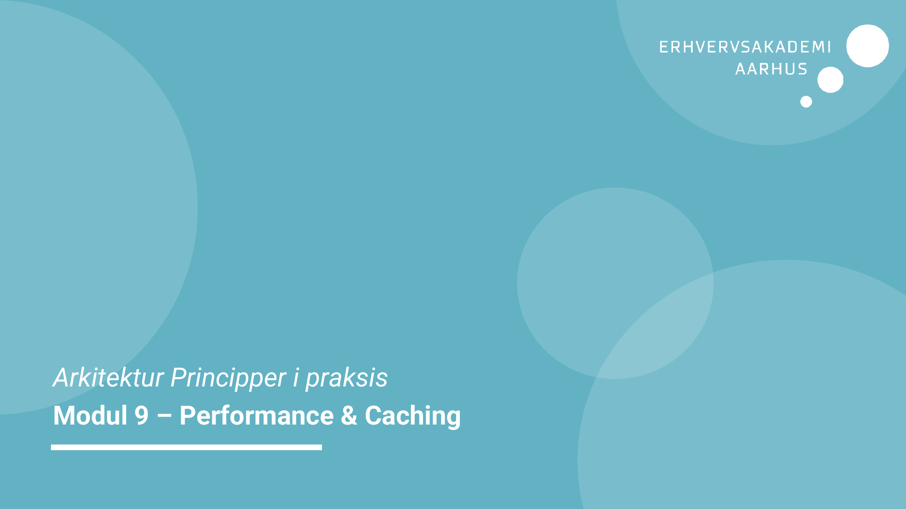
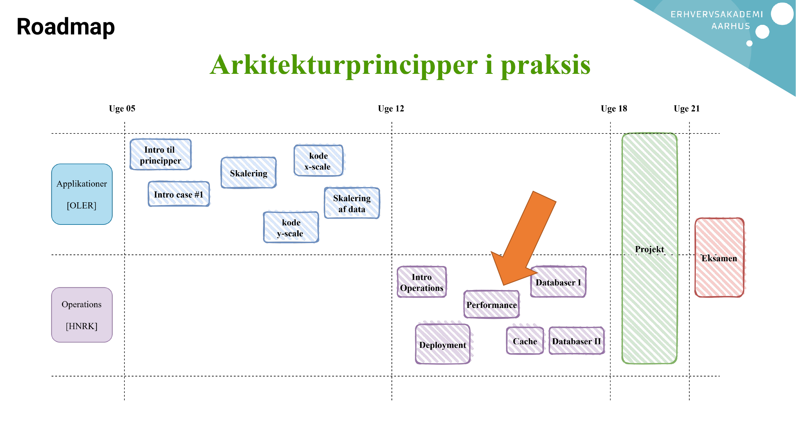
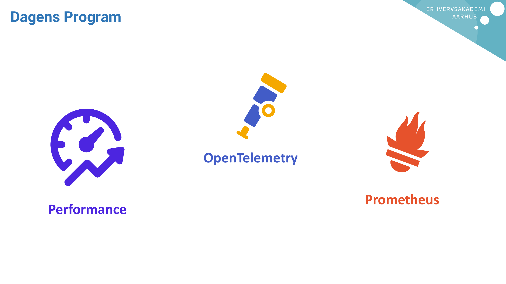
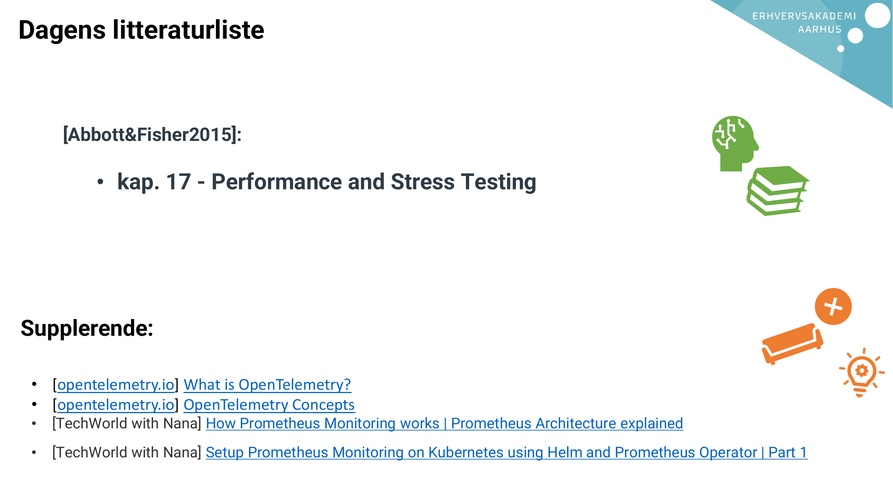
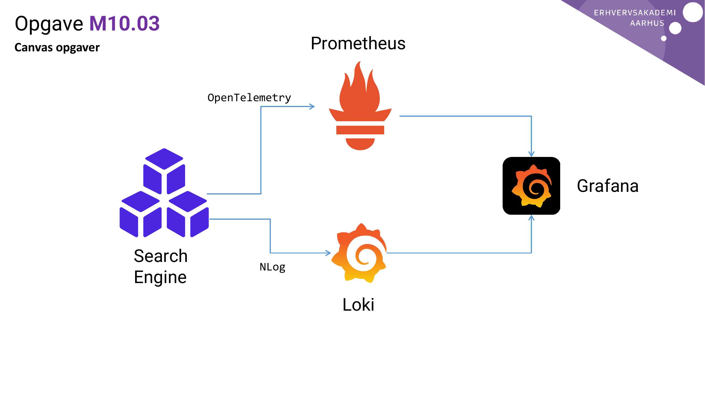
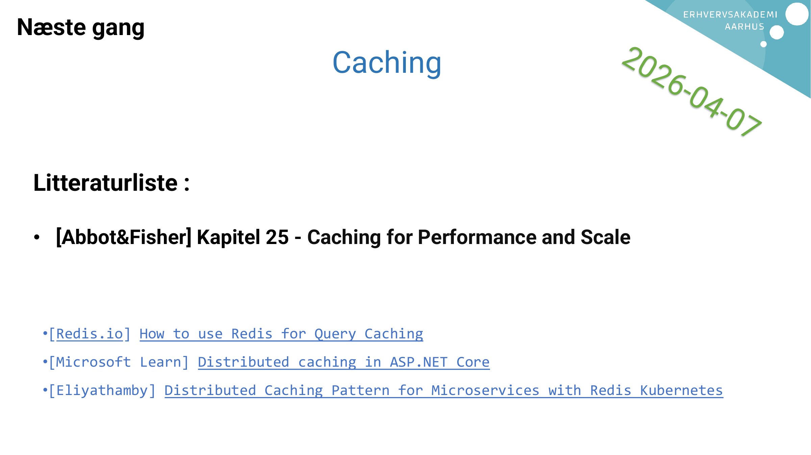

# AI Extract: Modul 9 - Performance metrics.pdf

- Kilde: `Modul 9 - Performance metrics.pdf`
- Type: `pdf`
- Artefakter: tekst + sidebilleder

## Tekst

```text
Arkitektur Principper i praksis
Modul 9 – Performance & Caching
Roadmap
Dagens Program


                  OpenTelemetry

                                  Prometheus
    Performance
Dagens litteraturliste


      [Abbott&Fisher2015]:

           • kap. 17 - Performance and Stress Testing


Supplerende:

 • [opentelemetry.io] What is OpenTelemetry?
 • [opentelemetry.io] OpenTelemetry Concepts
 •   [TechWorld with Nana] How Prometheus Monitoring works | Prometheus Architecture explained
 •   [TechWorld with Nana] Setup Prometheus Monitoring on Kubernetes using Helm and Prometheus Operator | Part 1
Afrunding
Opgave M10.03
Canvas opgaver                            Prometheus

                          OpenTelemetry


                                                       Grafana


                 Search           NLog
                 Engine
                                             Loki
Næste gang
                                    Caching


 Litteraturliste :

 • [Abbot&Fisher] Kapitel 25 - Caching for Performance and Scale


  •[Redis.io] How to use Redis for Query Caching
  •[Microsoft Learn] Distributed caching in ASP.NET Core
  •[Eliyathamby] Distributed Caching Pattern for Microservices with Redis Kubernetes

```

## Sider som billeder









