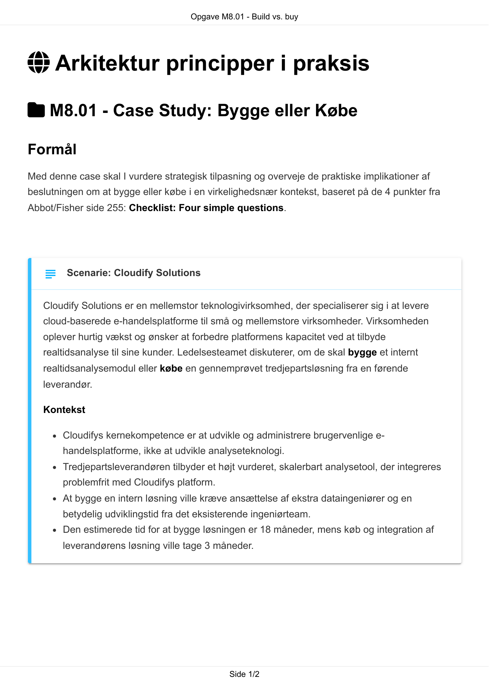
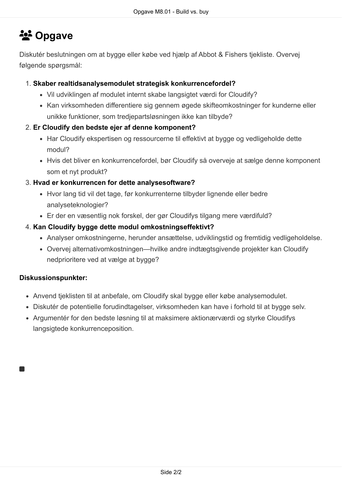

# AI Extract: Opgave M8.01 - Build vs. buy.pdf

- Kilde: `Opgave M8.01 - Build vs. buy.pdf`
- Type: `pdf`
- Artefakter: tekst + sidebilleder

## Tekst

```text
                                      Opgave M8.01 - Build vs. buy


 Arkitektur principper i praksis

 M8.01 - Case Study: Bygge eller Købe

Formål
Med denne case skal I vurdere strategisk tilpasning og overveje de praktiske implikationer af
beslutningen om at bygge eller købe i en virkelighedsnær kontekst, baseret på de 4 punkter fra
Abbot/Fisher side 255: Checklist: Four simple questions.


    Scenarie: Cloudify Solutions
   Cloudify Solutions er en mellemstor teknologivirksomhed, der specialiserer sig i at levere
   cloud-baserede e-handelsplatforme til små og mellemstore virksomheder. Virksomheden
   oplever hurtig vækst og ønsker at forbedre platformens kapacitet ved at tilbyde
   realtidsanalyse til sine kunder. Ledelsesteamet diskuterer, om de skal bygge et internt
   realtidsanalysemodul eller købe en gennemprøvet tredjepartsløsning fra en førende
   leverandør.

   Kontekst

        Cloudifys kernekompetence er at udvikle og administrere brugervenlige e-
        handelsplatforme, ikke at udvikle analyseteknologi.
        Tredjepartsleverandøren tilbyder et højt vurderet, skalerbart analysetool, der integreres
        problemfrit med Cloudifys platform.
        At bygge en intern løsning ville kræve ansættelse af ekstra dataingeniører og en
        betydelig udviklingstid fra det eksisterende ingeniørteam.
        Den estimerede tid for at bygge løsningen er 18 måneder, mens køb og integration af
        leverandørens løsning ville tage 3 måneder.


                                                Side 1/2
                                       Opgave M8.01 - Build vs. buy


 Opgave
Diskutér beslutningen om at bygge eller købe ved hjælp af Abbot & Fishers tjekliste. Overvej
følgende spørgsmål:

    1. Skaber realtidsanalysemodulet strategisk konkurrencefordel?
          Vil udviklingen af modulet internt skabe langsigtet værdi for Cloudify?
          Kan virksomheden differentiere sig gennem øgede skifteomkostninger for kunderne eller
          unikke funktioner, som tredjepartsløsningen ikke kan tilbyde?
    2. Er Cloudify den bedste ejer af denne komponent?
          Har Cloudify ekspertisen og ressourcerne til effektivt at bygge og vedligeholde dette
          modul?
          Hvis det bliver en konkurrencefordel, bør Cloudify så overveje at sælge denne komponent
          som et nyt produkt?
    3. Hvad er konkurrencen for dette analysesoftware?
          Hvor lang tid vil det tage, før konkurrenterne tilbyder lignende eller bedre
          analyseteknologier?
          Er der en væsentlig nok forskel, der gør Cloudifys tilgang mere værdifuld?
    4. Kan Cloudify bygge dette modul omkostningseffektivt?
          Analyser omkostningerne, herunder ansættelse, udviklingstid og fremtidig vedligeholdelse.
          Overvej alternativomkostningen—hvilke andre indtægtsgivende projekter kan Cloudify
          nedprioritere ved at vælge at bygge?

Diskussionspunkter:

      Anvend tjeklisten til at anbefale, om Cloudify skal bygge eller købe analysemodulet.
      Diskutér de potentielle forudindtagelser, virksomheden kan have i forhold til at bygge selv.
      Argumentér for den bedste løsning til at maksimere aktionærværdi og styrke Cloudifys
      langsigtede konkurrenceposition.





                                                 Side 2/2

```

## Sider som billeder




