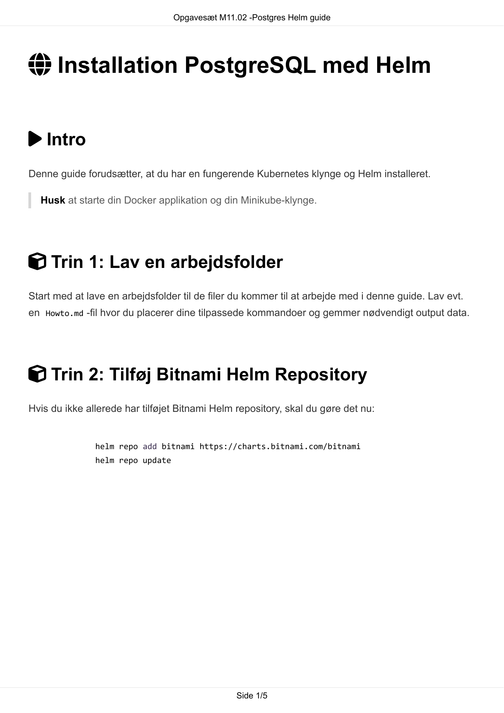
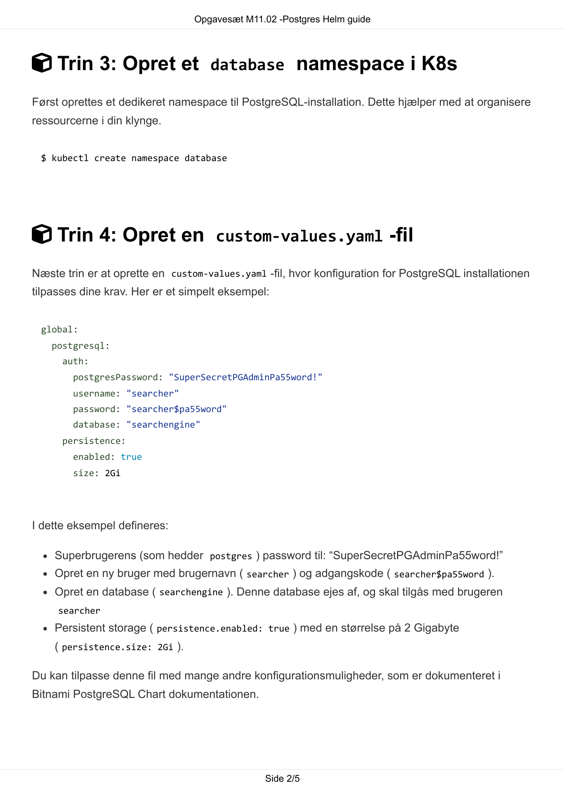
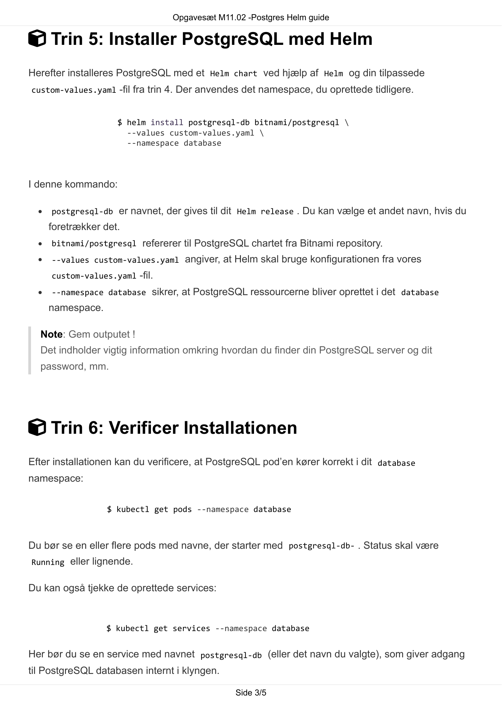
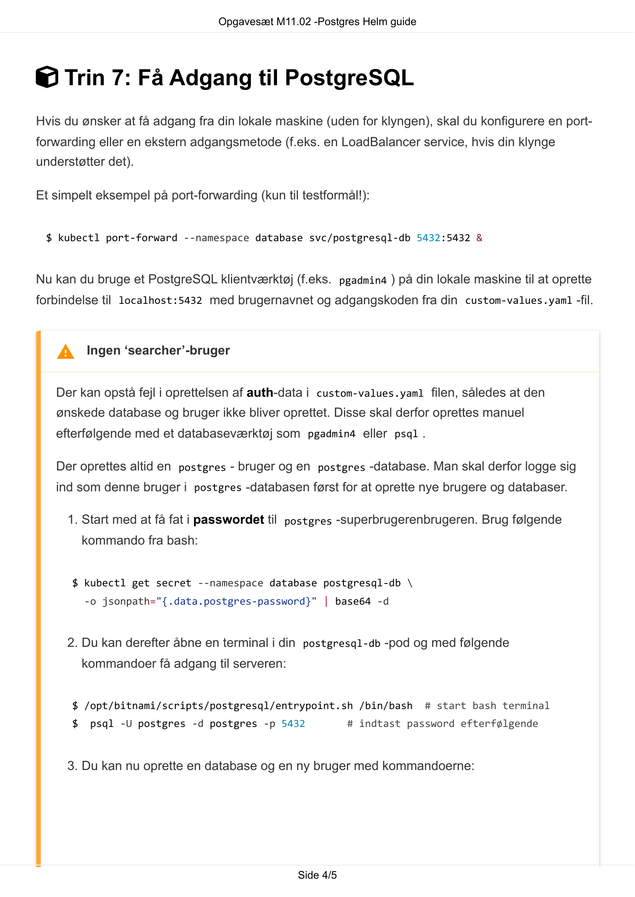
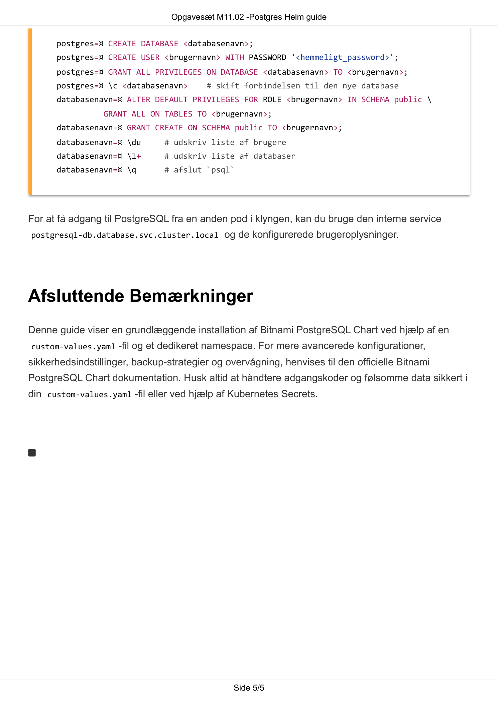

# AI Extract: Opgavesæt M11.02 -Postgres Helm guide (1).pdf

- Kilde: `Opgavesæt M11.02 -Postgres Helm guide (1).pdf`
- Type: `pdf`
- Artefakter: tekst + sidebilleder

## Tekst

```text
                                  Opgavesæt M11.02 -Postgres Helm guide


 Installation PostgreSQL med Helm


 Intro
Denne guide forudsætter, at du har en fungerende Kubernetes klynge og Helm installeret.

  Husk at starte din Docker applikation og din Minikube-klynge.


 Trin 1: Lav en arbejdsfolder
Start med at lave en arbejdsfolder til de filer du kommer til at arbejde med i denne guide. Lav evt.
en Howto.md -fil hvor du placerer dine tilpassede kommandoer og gemmer nødvendigt output data.


 Trin 2: Tilføj Bitnami Helm Repository
Hvis du ikke allerede har tilføjet Bitnami Helm repository, skal du gøre det nu:


               helm repo add bitnami https://charts.bitnami.com/bitnami
               helm repo update


                                                Side 1/5
                                 Opgavesæt M11.02 -Postgres Helm guide


 Trin 3: Opret et database namespace i K8s
Først oprettes et dedikeret namespace til PostgreSQL-installation. Dette hjælper med at organisere
ressourcerne i din klynge.


 $ kubectl create namespace database


 Trin 4: Opret en custom-values.yaml -fil
Næste trin er at oprette en custom-values.yaml -fil, hvor konfiguration for PostgreSQL installationen
tilpasses dine krav. Her er et simpelt eksempel:


 global:
    postgresql:
      auth:
        postgresPassword: "SuperSecretPGAdminPa55word!"
        username: "searcher"
        password: "searcher$pa55word"
        database: "searchengine"
      persistence:
        enabled: true
        size: 2Gi


I dette eksempel defineres:

    Superbrugerens (som hedder postgres ) password til: “SuperSecretPGAdminPa55word!”
    Opret en ny bruger med brugernavn ( searcher ) og adgangskode ( searcher$pa55word ).
    Opret en database ( searchengine ). Denne database ejes af, og skal tilgås med brugeren
     searcher
    Persistent storage ( persistence.enabled: true ) med en størrelse på 2 Gigabyte
    ( persistence.size: 2Gi ).

Du kan tilpasse denne fil med mange andre konfigurationsmuligheder, som er dokumenteret i
Bitnami PostgreSQL Chart dokumentationen.


                                               Side 2/5
                                 Opgavesæt M11.02 -Postgres Helm guide

 Trin 5: Installer PostgreSQL med Helm
Herefter installeres PostgreSQL med et Helm chart ved hjælp af Helm og din tilpassede
custom-values.yaml -fil fra trin 4. Der anvendes det namespace, du oprettede tidligere.


                    $ helm install postgresql-db bitnami/postgresql \
                      --values custom-values.yaml \
                      --namespace database


I denne kommando:

     postgresql-db er navnet, der gives til dit Helm release . Du kan vælge et andet navn, hvis du
    foretrækker det.
     bitnami/postgresql refererer til PostgreSQL chartet fra Bitnami repository.
     --values custom-values.yaml angiver, at Helm skal bruge konfigurationen fra vores
     custom-values.yaml -fil.
     --namespace database sikrer, at PostgreSQL ressourcerne bliver oprettet i det database
    namespace.

  Note: Gem outputet !
  Det indholder vigtig information omkring hvordan du finder din PostgreSQL server og dit
  password, mm.


 Trin 6: Verificer Installationen
Efter installationen kan du verificere, at PostgreSQL pod’en kører korrekt i dit database
namespace:

                  $ kubectl get pods --namespace database


Du bør se en eller flere pods med navne, der starter med postgresql-db- . Status skal være
Running eller lignende.


Du kan også tjekke de oprettede services:


                 $ kubectl get services --namespace database


Her bør du se en service med navnet postgresql-db (eller det navn du valgte), som giver adgang
til PostgreSQL databasen internt i klyngen.

                                               Side 3/5
                                 Opgavesæt M11.02 -Postgres Helm guide


 Trin 7: Få Adgang til PostgreSQL
Hvis du ønsker at få adgang fra din lokale maskine (uden for klyngen), skal du konfigurere en port-
forwarding eller en ekstern adgangsmetode (f.eks. en LoadBalancer service, hvis din klynge
understøtter det).

Et simpelt eksempel på port-forwarding (kun til testformål!):


 $ kubectl port-forward --namespace database svc/postgresql-db 5432:5432 &


Nu kan du bruge et PostgreSQL klientværktøj (f.eks. pgadmin4 ) på din lokale maskine til at oprette
forbindelse til localhost:5432 med brugernavnet og adgangskoden fra din custom-values.yaml -fil.


    Ingen ‘searcher’-bruger
   Der kan opstå fejl i oprettelsen af auth-data i custom-values.yaml filen, således at den
   ønskede database og bruger ikke bliver oprettet. Disse skal derfor oprettes manuel
   efterfølgende med et databaseværktøj som pgadmin4 eller psql .

   Der oprettes altid en postgres - bruger og en postgres -database. Man skal derfor logge sig
   ind som denne bruger i postgres -databasen først for at oprette nye brugere og databaser.

     1. Start med at få fat i passwordet til postgres -superbrugerenbrugeren. Brug følgende
          kommando fra bash:


      $ kubectl get secret --namespace database postgresql-db \
          -o jsonpath="{.data.postgres-password}" | base64 -d


     2. Du kan derefter åbne en terminal i din postgresql-db -pod og med følgende
          kommandoer få adgang til serveren:


      $ /opt/bitnami/scripts/postgresql/entrypoint.sh /bin/bash          # start bash terminal
      $    psql -U postgres -d postgres -p 5432           # indtast password efterfølgende


     3. Du kan nu oprette en database og en ny bruger med kommandoerne:


                                               Side 4/5
                                 Opgavesæt M11.02 -Postgres Helm guide


      postgres=¤ CREATE DATABASE <databasenavn>;
      postgres=¤ CREATE USER <brugernavn> WITH PASSWORD '<hemmeligt_password>';
      postgres=¤ GRANT ALL PRIVILEGES ON DATABASE <databasenavn> TO <brugernavn>;
      postgres=¤ \c <databasenavn>       # skift forbindelsen til den nye database
      databasenavn=¤ ALTER DEFAULT PRIVILEGES FOR ROLE <brugernavn> IN SCHEMA public \
                 GRANT ALL ON TABLES TO <brugernavn>;
      databasenavn-¤ GRANT CREATE ON SCHEMA public TO <brugernavn>;
      databasenavn=¤ \du       # udskriv liste af brugere
      databasenavn=¤ \l+       # udskriv liste af databaser
      databasenavn=¤ \q        # afslut `psql`


For at få adgang til PostgreSQL fra en anden pod i klyngen, kan du bruge den interne service
postgresql-db.database.svc.cluster.local og de konfigurerede brugeroplysninger.


Afsluttende Bemærkninger
Denne guide viser en grundlæggende installation af Bitnami PostgreSQL Chart ved hjælp af en
custom-values.yaml -fil og et dedikeret namespace. For mere avancerede konfigurationer,
sikkerhedsindstillinger, backup-strategier og overvågning, henvises til den officielle Bitnami
PostgreSQL Chart dokumentation. Husk altid at håndtere adgangskoder og følsomme data sikkert i
din custom-values.yaml -fil eller ved hjælp af Kubernetes Secrets.





                                                Side 5/5

```

## Sider som billeder







