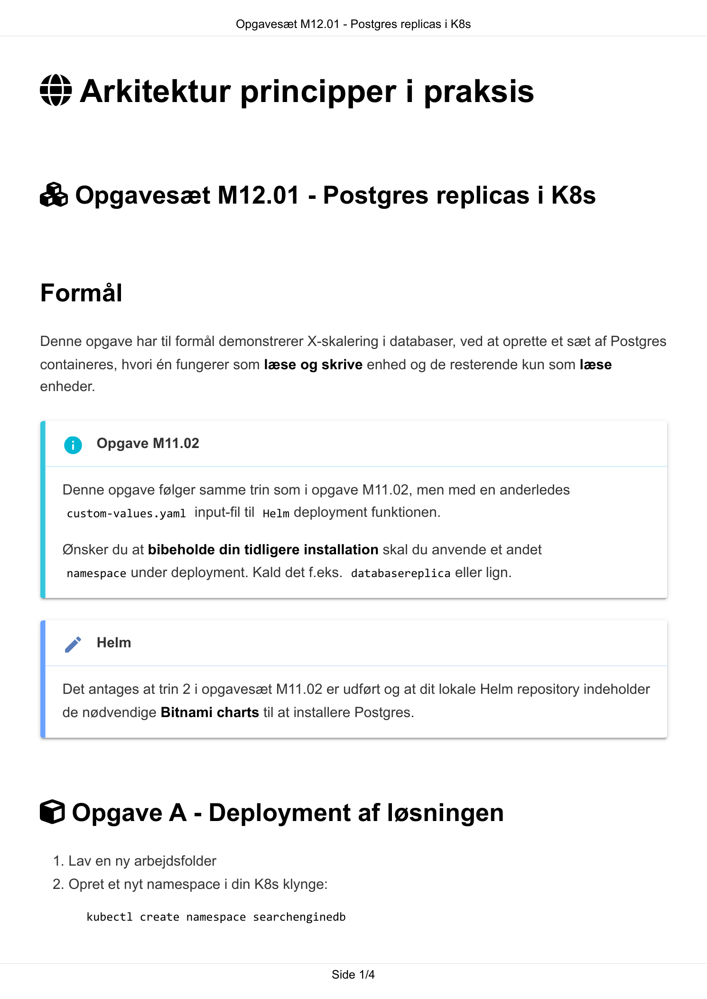
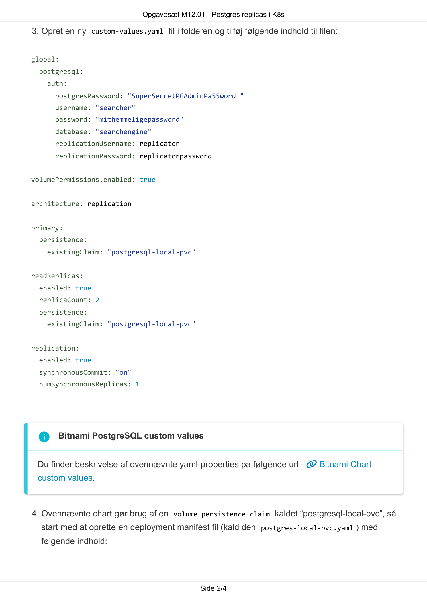
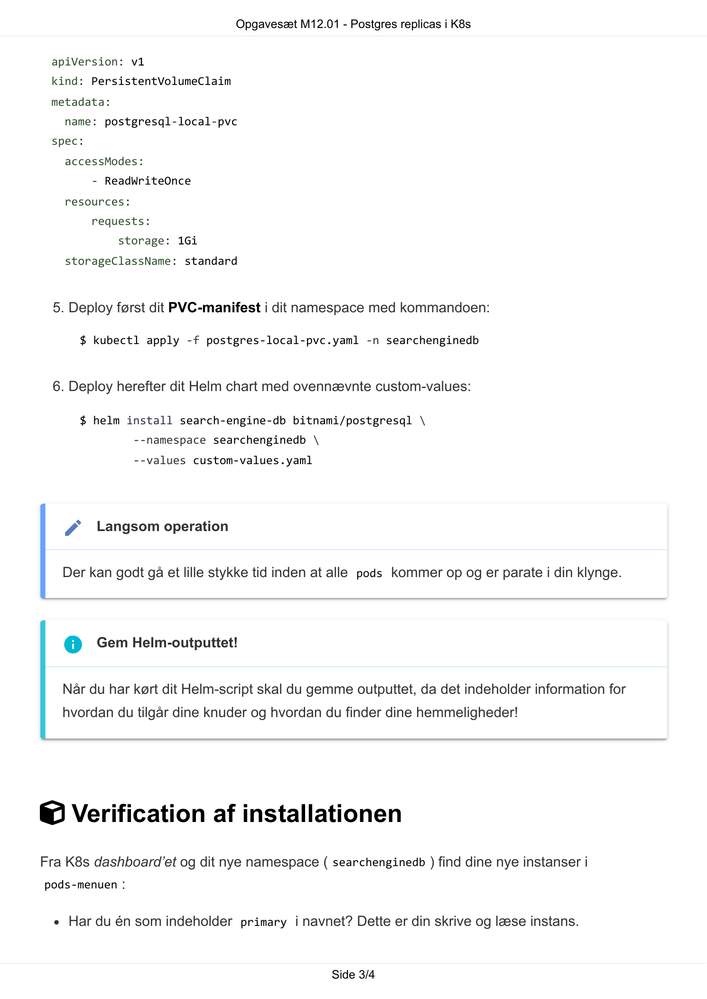
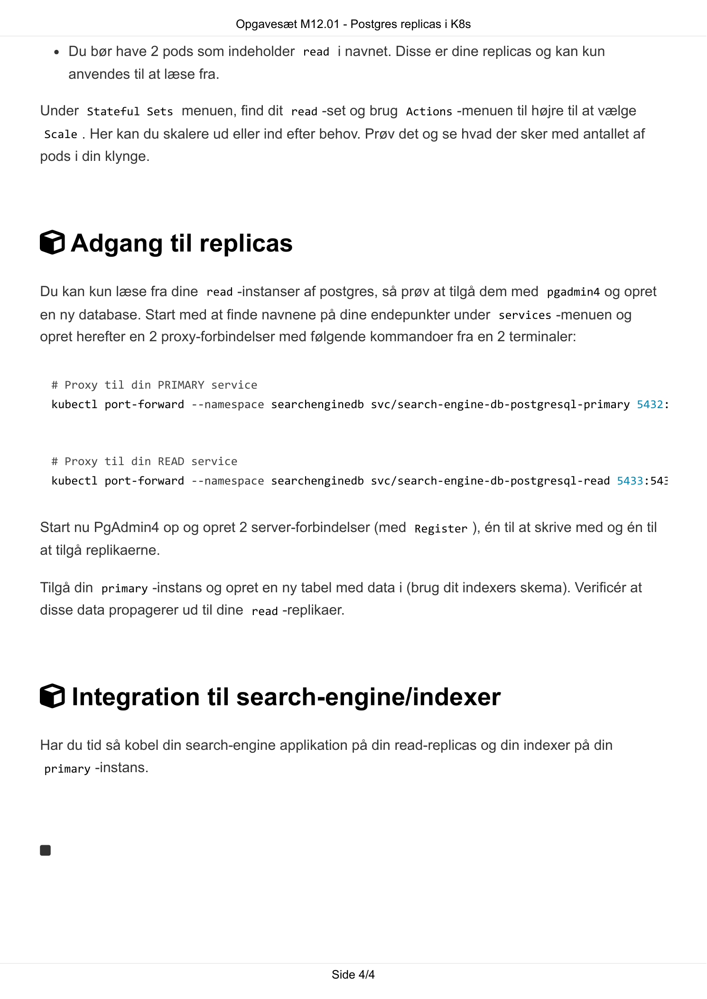

# AI Extract: Opgavesæt M12.01 - Postgres replicas i K8s.pdf

- Kilde: `Opgavesæt M12.01 - Postgres replicas i K8s.pdf`
- Type: `pdf`
- Artefakter: tekst + sidebilleder

## Tekst

```text
                               Opgavesæt M12.01 - Postgres replicas i K8s


 Arkitektur principper i praksis


 Opgavesæt M12.01 - Postgres replicas i K8s


Formål
Denne opgave har til formål demonstrerer X-skalering i databaser, ved at oprette et sæt af Postgres
containeres, hvori én fungerer som læse og skrive enhed og de resterende kun som læse
enheder.


    Opgave M11.02
   Denne opgave følger samme trin som i opgave M11.02, men med en anderledes
    custom-values.yaml input-fil til Helm deployment funktionen.


   Ønsker du at bibeholde din tidligere installation skal du anvende et andet
    namespace under deployment. Kald det f.eks. databasereplica eller lign.


    Helm
   Det antages at trin 2 i opgavesæt M11.02 er udført og at dit lokale Helm repository indeholder
   de nødvendige Bitnami charts til at installere Postgres.


 Opgave A - Deployment af løsningen
 1. Lav en ny arbejdsfolder
 2. Opret et nyt namespace i din K8s klynge:

       kubectl create namespace searchenginedb


                                                Side 1/4
                               Opgavesæt M12.01 - Postgres replicas i K8s

3. Opret en ny custom-values.yaml fil i folderen og tilføj følgende indhold til filen:


global:
  postgresql:
    auth:
      postgresPassword: "SuperSecretPGAdminPa55word!"
      username: "searcher"
      password: "mithemmeligepassword"
      database: "searchengine"
      replicationUsername: replicator
      replicationPassword: replicatorpassword


volumePermissions.enabled: true


architecture: replication


primary:
  persistence:
    existingClaim: "postgresql-local-pvc"


readReplicas:
  enabled: true
  replicaCount: 2
  persistence:
    existingClaim: "postgresql-local-pvc"


replication:
  enabled: true
  synchronousCommit: "on"
  numSynchronousReplicas: 1


  Bitnami PostgreSQL custom values
 Du finder beskrivelse af ovennævnte yaml-properties på følgende url -  Bitnami Chart
 custom values.


4. Ovennævnte chart gør brug af en volume persistence claim kaldet “postgresql-local-pvc”, så
  start med at oprette en deployment manifest fil (kald den postgres-local-pvc.yaml ) med
  følgende indhold:


                                                Side 2/4
                               Opgavesæt M12.01 - Postgres replicas i K8s


 apiVersion: v1
 kind: PersistentVolumeClaim
 metadata:
   name: postgresql-local-pvc
 spec:
   accessModes:
         - ReadWriteOnce
   resources:
         requests:
             storage: 1Gi
   storageClassName: standard


 5. Deploy først dit PVC-manifest i dit namespace med kommandoen:

      $ kubectl apply -f postgres-local-pvc.yaml -n searchenginedb


 6. Deploy herefter dit Helm chart med ovennævnte custom-values:

      $ helm install search-engine-db bitnami/postgresql \
                --namespace searchenginedb \
                --values custom-values.yaml


    Langsom operation
   Der kan godt gå et lille stykke tid inden at alle pods kommer op og er parate i din klynge.


    Gem Helm-outputtet!
   Når du har kørt dit Helm-script skal du gemme outputtet, da det indeholder information for
   hvordan du tilgår dine knuder og hvordan du finder dine hemmeligheder!


 Verification af installationen
Fra K8s dashboard’et og dit nye namespace ( searchenginedb ) find dine nye instanser i
pods-menuen :


    Har du én som indeholder primary i navnet? Dette er din skrive og læse instans.


                                                Side 3/4
                                  Opgavesæt M12.01 - Postgres replicas i K8s

      Du bør have 2 pods som indeholder read i navnet. Disse er dine replicas og kan kun
      anvendes til at læse fra.

Under Stateful Sets menuen, find dit read -set og brug Actions -menuen til højre til at vælge
Scale . Her kan du skalere ud eller ind efter behov. Prøv det og se hvad der sker med antallet af
pods i din klynge.


 Adgang til replicas
Du kan kun læse fra dine read -instanser af postgres, så prøv at tilgå dem med pgadmin4 og opret
en ny database. Start med at finde navnene på dine endepunkter under services -menuen og
opret herefter en 2 proxy-forbindelser med følgende kommandoer fra en 2 terminaler:


    # Proxy til din PRIMARY service
    kubectl port-forward --namespace searchenginedb svc/search-engine-db-postgresql-primary 5432:


    # Proxy til din READ service
    kubectl port-forward --namespace searchenginedb svc/search-engine-db-postgresql-read 5433:543


Start nu PgAdmin4 op og opret 2 server-forbindelser (med Register ), én til at skrive med og én til
at tilgå replikaerne.

Tilgå din primary -instans og opret en ny tabel med data i (brug dit indexers skema). Verificér at
disse data propagerer ud til dine read -replikaer.


 Integration til search-engine/indexer
Har du tid så kobel din search-engine applikation på din read-replicas og din indexer på din
primary -instans.





                                                   Side 4/4

```

## Sider som billeder






