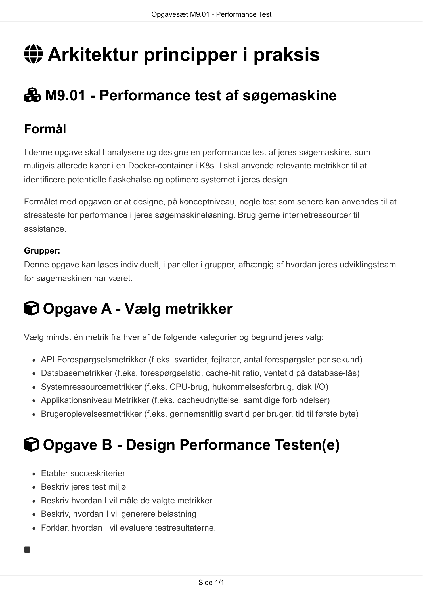

# AI Extract: Opgavesæt M9.01 - Performance Test.pdf

- Kilde: `Opgavesæt M9.01 - Performance Test.pdf`
- Type: `pdf`
- Artefakter: tekst + sidebilleder

## Tekst

```text
                                  Opgavesæt M9.01 - Performance Test


 Arkitektur principper i praksis

 M9.01 - Performance test af søgemaskine

Formål
I denne opgave skal I analysere og designe en performance test af jeres søgemaskine, som
muligvis allerede kører i en Docker-container i K8s. I skal anvende relevante metrikker til at
identificere potentielle flaskehalse og optimere systemet i jeres design.

Formålet med opgaven er at designe, på konceptniveau, nogle test som senere kan anvendes til at
stressteste for performance i jeres søgemaskineløsning. Brug gerne internetressourcer til
assistance.

Grupper:
Denne opgave kan løses individuelt, i par eller i grupper, afhængig af hvordan jeres udviklingsteam
for søgemaskinen har været.


 Opgave A - Vælg metrikker
Vælg mindst én metrik fra hver af de følgende kategorier og begrund jeres valg:

    API Forespørgselsmetrikker (f.eks. svartider, fejlrater, antal forespørgsler per sekund)
    Databasemetrikker (f.eks. forespørgselstid, cache-hit ratio, ventetid på database-lås)
    Systemressourcemetrikker (f.eks. CPU-brug, hukommelsesforbrug, disk I/O)
    Applikationsniveau Metrikker (f.eks. cacheudnyttelse, samtidige forbindelser)
    Brugeroplevelsesmetrikker (f.eks. gennemsnitlig svartid per bruger, tid til første byte)


 Opgave B - Design Performance Testen(e)
    Etabler succeskriterier
    Beskriv jeres test miljø
    Beskriv hvordan I vil måle de valgte metrikker
    Beskriv, hvordan I vil generere belastning
    Forklar, hvordan I vil evaluere testresultaterne.




                                                 Side 1/1

```

## Sider som billeder



