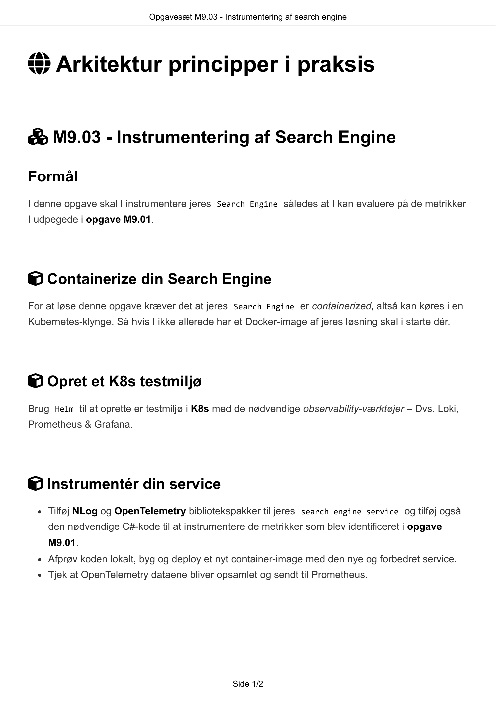
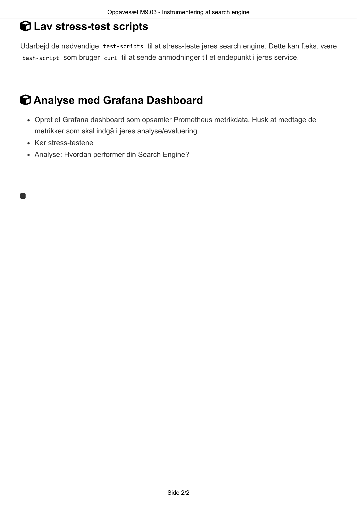

# AI Extract: Opgavesæt M9.03 - Instrumentering af search engine.pdf

- Kilde: `Opgavesæt M9.03 - Instrumentering af search engine.pdf`
- Type: `pdf`
- Artefakter: tekst + sidebilleder

## Tekst

```text
                            Opgavesæt M9.03 - Instrumentering af search engine


 Arkitektur principper i praksis


 M9.03 - Instrumentering af Search Engine

Formål
I denne opgave skal I instrumentere jeres Search Engine således at I kan evaluere på de metrikker
I udpegede i opgave M9.01.


 Containerize din Search Engine
For at løse denne opgave kræver det at jeres Search Engine er containerized, altså kan køres i en
Kubernetes-klynge. Så hvis I ikke allerede har et Docker-image af jeres løsning skal i starte dér.


 Opret et K8s testmiljø
Brug Helm til at oprette er testmiljø i K8s med de nødvendige observability-værktøjer – Dvs. Loki,
Prometheus & Grafana.


 Instrumentér din service
    Tilføj NLog og OpenTelemetry bibliotekspakker til jeres search engine service og tilføj også
    den nødvendige C#-kode til at instrumentere de metrikker som blev identificeret i opgave
    M9.01.
    Afprøv koden lokalt, byg og deploy et nyt container-image med den nye og forbedret service.
    Tjek at OpenTelemetry dataene bliver opsamlet og sendt til Prometheus.


                                                 Side 1/2
                           Opgavesæt M9.03 - Instrumentering af search engine

 Lav stress-test scripts
Udarbejd de nødvendige test-scripts til at stress-teste jeres search engine. Dette kan f.eks. være
bash-script som bruger curl til at sende anmodninger til et endepunkt i jeres service.


 Analyse med Grafana Dashboard
    Opret et Grafana dashboard som opsamler Prometheus metrikdata. Husk at medtage de
    metrikker som skal indgå i jeres analyse/evaluering.
    Kør stress-testene
    Analyse: Hvordan performer din Search Engine?





                                                Side 2/2

```

## Sider som billeder




